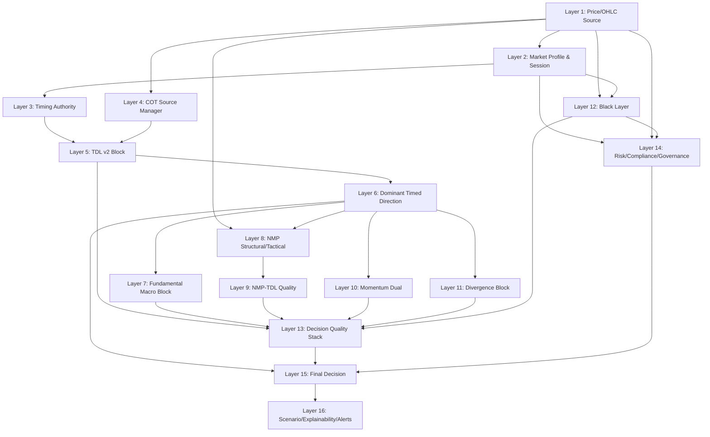
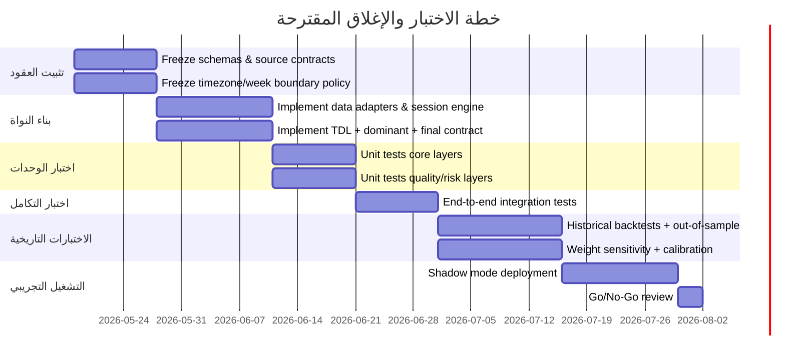

# NDSP Governance Files Combined

> هذا الملف توثيقي فقط.
> تم جمع محتوى الملفات الموجودة في مجلد governance داخل ملف Markdown واحد.
> لا تستبدل بهذا الملف ملفات التشغيل الأصلية.


---

## deep-research-report.md

```markdown
# جاهزية إغلاق هيكلة NDSP Decision Architecture V4.1

## ملخّص تنفيذي

الخلاصة العملية: **هيكلة NDSP V4.1 ناضجة كعقد معماري ويمكن البدء بتنفيذها هندسيًا على شكل بناء مرحلي (phased build)، لكنها ليست جاهزة بعد للإغلاق النهائي أو للنشر الإنتاجي الكامل**. سبب ذلك ليس في تسلسل الطبقات أو فصل السلطات—فهذان الجانبان أصبحا واضحين إلى حد كبير—بل في بقاء **سبعة ملفات حاسمة غير مغلقة**: تثبيت مصدر/عائلة تقارير COT حسب نوع الأصل، تجميد المنطقة الزمنية المرجعية لأيام السيطرة والـ Weekly Open، تعيين مصادر رسمية/تشغيلية لطبقات الماكرو مع حل فجوة “التوقع/الـ consensus”، تقنين أوزان `Decision Quality Stack` وتضمين `Golden Alignment` و`Weekly Open Gravity` فيها نصًا، إغلاق تعريفات الزخم/الدايفرجنس/Black Layer، حل التناقض الترتيبي بين `Final Decision` و`Scenario Layer`، ثم المرور بحزمة اختبارات تاريخية وتشغيلية صارمة قبل اعتماد الإغلاق. مصادر البيانات الرسمية المتاحة والقابلة للبناء عليها موجودة بالفعل عبر urlCFTCturn0search3 وurlBinance Open Platformturn4search0 وurlFXCM Market Dataturn20search0 وurlMQL4 Referenceturn2search1، لكن الجاهزية الإنتاجية تتطلب أكثر من توافر المصدر؛ تتطلب **عقد بيانات محكَمًا، سياسات staleness واضحة، ومعايرة طبقات الجودة**. citeturn6view2turn6view3turn6view5turn20search0turn20search1turn13view2turn13view3turn7view0turn7view1turn6view8turn6view9

توصيتي النهائية في نهاية التقرير ستكون: **غير جاهزين للإغلاق النهائي الآن**، لكن **جاهزون لبدء تنفيذ مرحلي منضبط** بشرط إغلاق مجموعة محددة من الشروط الإلزامية قبل اعتماد “النسخة المقفلة”.  

## الفحص المعماري الكامل

### قراءة عامة للحالة

المعمارية الحالية تحقق أربع مزايا كبيرة:

1. **فصل واضح بين من يحدد الاتجاه ومن يحسب الثقة ومن يرفع/يخفض الخطر**.
2. **وجود عقد قرار نهائي** يجعل `Final Decision` مجمِّعًا لا “محركًا بديلًا”.
3. **منع تعدد سلطات الاتجاه** عبر حصر `decision.direction` في `Dominant Timed Direction`.
4. **قابلية اختبار عالية** إذا تم تجميد عقود البيانات والأوزان والحدود.

لكن توجد أيضًا أربع ملاحظات معمارية مهمّة:

- **فجوة COT حسب نوع الأصل**: تقارير CFTC ليست عائلة واحدة. التقرير `TFF` يخص العقود المالية ويستخدم فئات `Dealer/Intermediary`, `Asset Manager/Institutional`, `Leveraged Funds`, `Other Reportables`، بينما التقرير `Disaggregated` يخص العقود المادية مثل الطاقة والمعادن والزراعة ويستخدم `Producer/Merchant/Processor/User`, `Swap Dealers`, `Managed Money`, `Other Reportables`. لذلك لا يجوز تطبيق نفس الـ mapping على الفوركس/الفائدة/المؤشرات وعلى الذهب/النفط دون طبقة اختيار report family صريحة. هذه نقطة **حرجة** لإغلاق المعمارية. citeturn23view0turn6view0turn6view1
- **فجوة التوقيت المرجعي**: `Timing Authority` و`Weekly Open Gravity` يعتمدان ضمنيًا على “اليوم” و“الافتتاح الأسبوعي”، لكن مصادر السوق الرسمية لا تستخدم نفس الساعة دائمًا. في Binance يمكن التعامل مع klines بمرجعية UTC بشكل افتراضي ويُسمح بتمرير `timeZone` في REST، بينما في MT4 تعتمد دوال مثل `DayOfWeek()` و`TimeCurrent()` على **آخر وقت خادم معروف**. إذا لم تُجمَّد timezone canonical داخل NDSP فستظهر فروقات حدودية حول منتصف الليل وبداية الأسبوع. citeturn6view4turn9view1turn11view0turn13view5turn6view9
- **فجوة مصادر الماكرو**: `Fed Rate Regime` و`Weighted US News Score` يحتاجان ليس فقط إلى الأحداث الرسمية والقراءات الفعلية، بل أيضًا إلى **التوقع/الإجماع** لحساب surprise. الجداول الرسمية من الاحتياطي الفيدرالي وBLS وBEA وCensus تعطي توقيتات وإصدارات وبيانات فعلية، لكن حقل `consensus / forecast` ليس مثبتًا كمصدر رسمي داخل المعمارية الحالية. لذلك هذه الطبقات **غير مغلقة المصدر** بعد. citeturn22view0turn22view1turn22view2turn22view3
- **تناقض ترتيبي صغير لكنه مهم**: النسخة الحالية تجعل `Final Decision` يأخذ `scenario_state` من `Scenario Layer`، بينما `Scenario Layer` موضوعة بعد `Final Decision`. هذا يعني أن `Scenario` يجب أن تصبح **مستهلكًا للقرار النهائي** لا مصدرًا له، أو يتم فصل “scenario pre-state” في طبقة سابقة. هذه نقطة يجب إصلاحها قبل الإغلاق.

### الفحص طبقة بطبقة

### طبقات البيانات والسياق

**Layer 1 — Symbol + Market + OHLC Source**  
- **المخرجات**: `symbol`, `market_type`, `price`, `ohlc`, `spread`, `volume`, `source`, `data_freshness`, `timestamp`.
- **مصدر المخرجات**:  
  - الكريبتو من Binance Spot: أفضل bid/ask عبر `bookTicker` أو `ticker.book`، والشموع عبر `klines`، وزمن الخادم عبر `/api/v3/time`. `bookTicker` لحظي، وkline stream يتحدث كل ثانية لشمعة `1s` وكل ثانيتين للفواصل الأخرى، وREST klines تُعرَّف بالـ open time. citeturn11view0turn9view0turn9view3turn6view4turn4search2  
  - الأسواق التقليدية عبر FXCM/MT4: FXCM يوفّر أسعارًا آنية مجمّعة best bid/offer متعددة المرات في الثانية، وMT4 يوفّر `MODE_BID`, `MODE_ASK`, `MODE_SPREAD`, `MODE_TIME` وOHLC عبر `iOpen/iHigh/iLow/iClose/iTime`. citeturn20search0turn20search1turn7view0turn7view1turn7view2turn6view8turn13view4
- **الصلاحية**: `Data Authority`.
- **المسموح**: التطبيع، الفحص، أعلام staleness، فحص اكتمال OHLC.
- **الممنوع**: تغيير الاتجاه أو الثقة أو القرار.
- **تقييمي**: مكتملة معماريًا، لكنها تحتاج **SLA/thresholds** صريحة لتصنيف “fresh / degraded / stale”.

**Layer 2 — Market Profile + Trading Session State**  
- **المخرجات**: `asset_class`, `session_state`, `market_state`, `liquidity_state`, `weekend_state`.
- **مصدر المخرجات**:  
  - `asset_class` من تصنيف داخلي.
  - `session_state` من ساعات المنتج/الرمز. FXCM يصرّح أن ساعات التداول تختلف حسب المنتج وأن نقص السيولة حول الافتتاح/الإغلاق قد يعيق التنفيذ أو يوصل أسعارًا غير ممثلة للسوق، ويمكن أن يؤخر فتح السوق أو يقدّم إغلاقه لبعض الأدوات. Binance يوفّر `status`/`symbolStatus` للحالة `TRADING/HALT/BREAK`. citeturn13view2turn13view3turn11view0turn10search5
- **الصلاحية**: `Market Context Authority`.
- **المسموح**: خفض الجودة، رفع `risk_state`، أو حجب القرار في السوق المغلق.
- **الممنوع**: توليد الاتجاه.
- **تقييمي**: قوية مفاهيميًا، لكن تحتاج **سياسة جلسات نهائية لكل asset_class** وحدودًا رقمية متفقًا عليها لـ `high_spread`, `low_liquidity`, `abnormal`.

**Layer 3 — Timing Authority**  
- **المخرجات**: `controller`, `controller_label`, `direction_source`, `day_group`, `decision_authority`.
- **مصدر المخرجات**: جدول داخلي للأيام (Monday/Friday = L&M، Tue–Sun = S)، مع override من session policy للأسواق المغلقة/ضعيفة السيولة.
- **الصلاحية**: `Timing Authority`.
- **المسموح**: اختيار المسيطر الزمني ومصدر الاتجاه.
- **الممنوع**: حساب الاتجاه أو تعديل الثقة.
- **تقييمي**: **جيد معماريًا**، لكنّه **غير مغلق زمنيًا** قبل تعريف timezone canonical. هذه نقطة blocker.

**Layer 4 — COT Source Manager**  
- **المخرجات**: `source_used`, `mapping_type`, `validity`, `precision_level`, `cot_age_days`, ويفترض إضافة `report_family`, `report_date`, `release_timestamp`.
- **مصدر المخرجات**:  
  - CFTC COT PRE / الملفات السنوية / التقارير الجارية. CFTC يطلق COT عادة الجمعة 3:30 مساءً ET ببيانات الثلاثاء السابق، ويوفّر PRE بلا token مع تنزيل بصيغ CSV/RDF/RSS/TSV/XML، كما يوفر ملفات سنوية text/excel وتنسيقات comma-delimited. كما تنص FAQs على أن البيانات التاريخية **لا يتم تعديلها بعد النشر**. citeturn6view2turn6view3turn17view0turn12search0  
- **الصلاحية**: `Data Authority`.
- **المسموح**: اختيار manual/auto/fallback، وإرسال جودة المصدر وreport family إلى TDL.
- **الممنوع**: كتابة الاتجاه النهائي مباشرة.
- **تقييمي**: **أكبر طبقة مصدرية تحتاج إغلاقًا**؛ لأن report family حسب الأصل لم يُجمَّد بعد، وmapping الحالي يعالج حالات لا تنتمي لنفس report family.

### كتلة TDL v2

**Layer 5.1 — L&M Macro Direction**  
- **المخرجات**: `macro.lm_direction`, `macro.lm_net`.
- **مصدر المخرجات**: صافي مراكز الفئة L&M بعد mapping من COT Source Manager.
- **الصلاحية**: `Direction Computation` داخل TDL.
- **المسموح**: حساب اتجاه بنيوي للفئة.
- **الممنوع**: كتابة `decision.direction`.
- **تقييمي**: يحتاج تعريفًا رياضيًا نهائيًا لـ threshold بين bullish/bearish/neutral.

**Layer 5.2 — S Macro Direction**  
- **المخرجات**: `macro.s_direction`, `macro.s_net`.
- **المصدر/الصلاحية/القيود**: نفس 5.1 لكن لفئة S.
- **التقييم**: يحتاج اختبار.

**Layer 5.3 — L&M Weekly Direction**  
- **المخرجات**: `weekly.lm_direction`, `weekly.lm_net_change`.
- **مصدر المخرجات**: فرق صافي الفئة الحالي عن الأسبوع السابق.
- **المسموح**: حساب اتجاه أسبوعي.
- **الممنوع**: كتابة القرار النهائي.
- **التقييم**: يحتاج اختبار backtest على أفق نهاية الأسبوع.

**Layer 5.4 — S Weekly Direction**  
- **المخرجات**: `weekly.s_direction`, `weekly.s_net_change`.
- **المصدر**: فرق صافي S أسبوعيًا.
- **التقييم**: يحتاج اختبار.

**Layer 5.5 — Correction State**  
- **المخرجات**: `lm_correction`, `s_correction`, `active_controller_correction`.
- **المصدر**: مقارنة macro vs weekly لنفس الفئة.
- **الصلاحية**: `Quality Context Authority`.
- **المسموح**: تعديل confidence/quality فقط.
- **الممنوع**: تغيير `decision.direction`.
- **التقييم**: جيدة جدًا مفهوميًا، تحتاج اختبار فعالية على الذهب/الفوركس/الكريبتو كلٌّ على حدة.

**Layer 5.6 — Participant Conflict State**  
- **المخرجات**: `participant_conflict`, `alignment_state`.
- **المصدر**: مقارنة `weekly.lm_direction` و`weekly.s_direction`.
- **الصلاحية**: `Quality Context Authority`.
- **المسموح**: رفع/خفض جودة القرار.
- **الممنوع**: تغيير الاتجاه.
- **التقييم**: قوية ومهمة، وتدعم لاحقًا `Golden Alignment`.

**Layer 5.7 — Nawaf Golden Alignment**  
- **المخرجات**: `golden_alignment.active`, `direction`, `state`, `strength`, `confidence_effect`.
- **المصدر**: تساوي `weekly.lm_direction == weekly.s_direction` مع عدم الحياد.
- **الصلاحية**: `Structural Alignment Authority` و`Quality Authority`.
- **المسموح**: رفع confidence/quality/grade وتحسين scenario.
- **الممنوع**: توليد الاتجاه أو تجاوزه.
- **التقييم**: **إضافة ممتازة**، لكنها **تحتاج شيئين قبل الإغلاق**:  
  1) تضمين `golden_alignment_effect` رسميًا في مدخلات `Decision Quality Stack` داخل العقد النصي النهائي.  
  2) إثبات lift تاريخي مقارنة ببيئة non-aligned.

### اتجاه القرار والطبقات الإثرائية

**Layer 6 — Dominant Timed Direction**  
- **المخرجات**: `dominant_timed_direction.direction`, `source`, `controller`.
- **المصدر**: `controller` من Layer 3 + `weekly.lm_direction` أو `weekly.s_direction` من TDL.
- **الصلاحية**: **Direction Authority الوحيدة** التي تكتب مصدر اتجاه القرار.
- **المسموح**: تحديد `decision.direction`.
- **الممنوع**: استقبال تأثيرات momentum/NMP/fundamental لتعديل الاتجاه.
- **التقييم**: **مغلق معماريًا**؛ ويجب أن يبقى كذلك.

**Layer 7.1 — Fed Rate Regime**  
- **المخرجات**: `current_rate`, `rate_change`, `hawkish_or_dovish_surprise`, `fed_bias`.
- **المصدر**: بيانات الفيدرالي الرسمية والبيانات التاريخية للاجتماعات والبيانات الصادرة. الفيدرالي يعلن القرار وبيان FOMC ويحتفظ بروزنامة الاجتماعات الرسمية. citeturn21search0turn22view0
- **الصلاحية**: `Macro Quality Authority`.
- **المسموح**: تأثير على الجودة والثقة والتحذيرات.
- **الممنوع**: تغيير الاتجاه.
- **التقييم**: **غير مغلقة المصدر بالكامل** لأن عنصر `expected_rate / surprise` يحتاج consensus خارجي أو manual consensus feed.

**Layer 7.2 — USD Strength**  
- **المخرجات**: `usd_bias`, `dollar_activity`, `dollar_pressure_score`.
- **المصدر**: غير مثبت بعد. يمكن بناؤه داخليًا من basket/market proxy أو مزود خارجي.
- **الصلاحية**: `Macro Quality Authority`.
- **المسموح**: رفع/خفض الثقة والجودة.
- **الممنوع**: الاتجاه.
- **التقييم**: **غير معرّف المصدر** حتى الآن.

**Layer 7.3 — Weighted US News Score**  
- **المخرجات**: `weighted_news_score`, `news_bias`, `impact_level`.
- **المصدر**: الجداول الرسمية للإصدارات الاقتصادية متاحة من BLS وBEA وCensus والفيدرالي، لكن **الجزء الخاص بالتوقع/forecast** غير مغلق داخل المعمارية الحالية. BLS وBEA وCensus ينشرون جداول ومواعيد وبيانات فعلية، لكن consensus field ليس جزءًا رسميًا ثابتًا في العقد الحالي. citeturn22view1turn22view2turn22view3turn22view0
- **الصلاحية**: `Macro Quality Authority`.
- **المسموح**: confidence/quality/warnings.
- **الممنوع**: الاتجاه.
- **التقييم**: **غير جاهزة للإغلاق** قبل تثبيت مزود forecast أو تبني design بدون surprise.

**Layer 7.4 — Asset-Specific Macro Effect**  
- **المخرجات**: `asset_macro_effect`, `macro_alignment_state`.
- **المصدر**: outputs من 7.1–7.3 + جدول قواعد لكل أصل.
- **الصلاحية**: `Macro Translation Authority`.
- **المسموح**: تعديل الجودة والثقة بحسب الأصل.
- **الممنوع**: الاتجاه.
- **التقييم**: تحتاج matrix rules نهائية، وخصوصًا للنفط `conditional` وليس `automatic`.

**Layer 8.1 — NMP Structural Anchor**  
- **المخرجات**: `nmp_point`, `nmp_zone`, `nmp_position`.
- **المصدر**: NMP البنيوي الداخلي.
- **الصلاحية**: `Structural Precision Authority`.
- **المسموح**: توفير anchor/context.
- **الممنوع**: الاتجاه.
- **التقييم**: معماريًا موجود، لكن **طريقة الحساب لم تُجمَّد نصيًا**.

**Layer 8.2 — NMP Tactical Context**  
- **المخرجات**: `nmp_signal`, `nmp_context`, `precision_state`.
- **المصدر**: السعر الحالي + NMP + dominant direction.
- **الصلاحية**: `Precision Authority`.
- **المسموح**: قراءة تكتيكية حول السعر.
- **الممنوع**: تغيير الاتجاه.
- **التقييم**: يحتاج اختبارات تكامل مع TDL.

**Layer 8.3 — Weekly Open Gravity**  
- **المخرجات**: `state`, `current_position`, `respect_state`, `gravity_strength`, `close_probability`, `confidence_effect`.
- **المصدر**: `weekly_open_price` + سلوك السعر حوله + `weekly.lm_direction`.
- **الصلاحية**: `Price Validation Authority` و`Structural Validation Authority`.
- **المسموح**: رفع/خفض الجودة والثقة وتحسين continuation probability.
- **الممنوع**: تغيير الاتجاه.
- **التقييم**: **إضافة عالية القيمة**، لكن **غير قابلة للإغلاق** قبل حسم نقطتين:
  1) ما هي week boundary canonical لكل سوق؟  
  2) هل weekly open يحسب من Binance UTC weekly bar أم من session open الفعلي؟ وفي MT4/FXCM هل نتبع broker week أم NDSP week؟  
  هذه فجوة تشغيلية أساسية. citeturn6view4turn9view1turn13view5turn6view9

**Layer 9 — NMP-TDL Quality**  
- **المخرجات**: `alignment_state`, `distance_state`, `quality_effect`.
- **المصدر**: 8.1 + 8.2 + 6.
- **الصلاحية**: `Quality Authority`.
- **المسموح**: تعديل الجودة فقط.
- **الممنوع**: الاتجاه.
- **التقييم**: يحتاج thresholds for near/extended/far.

**Layer 10 — Momentum Dual**  
- **المخرجات**: `momentum_signal`, `momentum_context`, `confidence_effect`.
- **المصدر**: غير مجمَّد رياضيًا داخل العقد الحالي.
- **الصلاحية**: `Quality/Confidence Authority`.
- **المسموح**: رفع/خفض confidence.
- **الممنوع**: الاتجاه.
- **التقييم**: **غير معرّف** حتى تجميد المؤشر/الأفق/القاعدة.

**Layer 11.1 — Regular Divergence**  
- **المخرجات**: `regular_divergence`, `warning_state`.
- **المصدر**: سعر + oscillator/series غير معرّف نهائيًا.
- **المسموح**: warning / confidence decrease.
- **الممنوع**: الاتجاه.
- **التقييم**: غير معرّف خوارزميًا.

**Layer 11.2 — Hidden Divergence**  
- **المخرجات**: `hidden_divergence`, `continuation_support`.
- **المصدر**: نفس فجوة 11.1.
- **التقييم**: غير معرّف خوارزميًا.

**Layer 11.3 — Divergence Alignment**  
- **المخرجات**: `divergence_alignment_state`, `confidence_effect`, `warning`.
- **المصدر**: 11.1 + 11.2 + dominant direction + NMP/momentum context.
- **الصلاحية**: `Quality Authority`.
- **المسموح**: تحويل divergence إلى effect رقمي.
- **الممنوع**: الاتجاه.
- **التقييم**: يحتاج algorithm definition واختبارات.

**Layer 12 — Black Layer**  
- **المخرجات**: `black_layer_state`, `risk_penalty`, `confidence_penalty`.
- **المصدر**: غير مجمَّد بالكامل؛ يفترض أن يجمع أحداث خطر/سيولة/بيانات/بيئة.
- **الصلاحية**: `Risk Escalation Authority`.
- **المسموح**: خفض confidence، رفع risk، حظر execution، تحويل `decision_state` إلى `blocked`.
- **الممنوع**: تغيير `decision.direction`.
- **التقييم**: **غير جاهز للإغلاق** حتى تُعرَّف trigger matrix وseverity ladder.

**Layer 13 — Decision Quality Stack**  
- **المخرجات**: `final_confidence`, `quality_score`, `grade`, `quality_label`, `confidence_breakdown`.
- **المصدر**: يجب أن يجمع من:  
  `TDL base`, `timing clarity`, `COT quality`, `correction`, `conflict`, `golden_alignment`, `fed/usd/news/asset macro`, `NMP-TDL quality`, `weekly_open_gravity`, `momentum`, `divergence`, `black/risk/data/session penalties`.
- **الصلاحية**: **Confidence Authority** و`Quality Authority`.
- **المسموح**: الثقة والدرجة والجودة فقط.
- **الممنوع**: الاتجاه.
- **التقييم**: **هذه الطبقة هي blocker رقم 1**. وجودها المعماري ممتاز، لكن من دون أوزان، bounds، caps، grade bands، وقواعد calibration، لا يوجد إغلاق جاهز. كما يجب تحديث العقد النصي الرسمي ليشمل `golden_alignment_effect` و`weekly_open_gravity_effect` صراحة.

### الحوكمة والقرار والعرض

**Layer 14.1 — Risk State**  
- **المخرجات**: `risk_state`, `risk_reason`.
- **المصدر**: session/data validity/black layer وربما مخاطر تشغيل.
- **الصلاحية**: `Risk Authority`.
- **المسموح**: state/risk escalation.
- **الممنوع**: الاتجاه.
- **التقييم**: يحتاج reason codes وحدودًا رقمية.

**Layer 14.2 — Compliance**  
- **المخرجات**: `sanitized=true`, `logic_leak=false`.
- **المصدر**: policy.
- **الصلاحية**: `Compliance/Governance Authority`.
- **المسموح**: تعقيم المخرجات.
- **الممنوع**: تعطيل الطبقات أو تغيير الاتجاه.
- **التقييم**: جيّدة، تحتاج audit logs.

**Layer 14.3 — Behavior**  
- **المخرجات**: `behavior_guidance`, `discipline_context`.
- **المصدر**: غير محدد بالكامل.
- **الصلاحية**: `Behavior Authority`.
- **المسموح**: guidance فقط.
- **الممنوع**: القرار.
- **التقييم**: قيمة إضافية، لكنها **غير معرّفة الاستهلاك**.

**Layer 14.4 — Governance Runtime**  
- **المخرجات**: `execution_allowed`, `execution_mode`, `decision_state`.
- **المصدر**: policy + risk/black/session.
- **الصلاحية**: `Execution/Governance Authority`.
- **المسموح**: `execution_allowed=false`, `decision_support_only`, blocking.
- **الممنوع**: تعديل الاتجاه أو تعطيل TDL.
- **التقييم**: جيّدة جدًا؛ تحتاج override policy وRBAC.

**Layer 15 — Final Decision**  
- **المخرجات**: `decision.contract`.
- **مصدر المخرجات**:
  - `direction` ← `dominant_timed_direction.direction`
  - `confidence/quality/grade` ← `Decision Quality Stack`
  - `risk_state` ← `Risk State + Black Layer + Session/Data validity`
  - `execution` ← `Governance Runtime`
  - `scenario_state` ← **يجب ألا يكون مصدرًا سابقًا على القرار النهائي في النسخة المقفلة**
- **الصلاحية**: `Aggregation Authority`.
- **المسموح**: التجميع فقط.
- **الممنوع**: التفكير من الصفر أو اشتقاق اتجاه جديد.
- **التقييم**: **قوية جدًا**، لكن يجب إصلاح paradox `Scenario -> Final Decision`.

**Layer 16 — Scenario / Explainability / Alerts**  
- **المخرجات**: `scenario_state/context`, `reason`, `confidence_explanation`, `risk_explanation`, `alerts/warnings`.
- **المصدر**: القرار النهائي + breakdowns + سياقات upstream.
- **الصلاحية**: `Narrative Authority`.
- **المسموح**: التفسير والعرض فقط.
- **الممنوع**: تعديل القرار.
- **التقييم**: يجب أن تصبح **consumer after Final Decision** بوضوح كامل.

### مخطط تدفق الطبقات المقترح بعد تصحيح التناقض الترتيبي



## نقاط الفحص المتبقية قبل الإغلاق

هذه هي القائمة التي أعتبرها **إلزامية** قبل إعلان “إغلاق معماري نهائي”:

### نقاط P0 الحرجة

1. **تثبيت `report_family` في COT Source Manager حسب الأصل**  
   - `TFF` للفوركس/الفائدة/المؤشرات المالية والعقود المالية.
   - `Disaggregated` للمعادن/الطاقة/السلع المادية.
   - `Legacy` فقط كـ fallback صريح ومشروح.  
   من دون هذا، mapping الفئات إلى `L&M` و`S` غير مكتمل. citeturn23view0turn6view0

2. **تثبيت timezone canonical لأيام السيطرة ولـ Weekly Open**  
   - ما هو “Monday” في `Timing Authority`؟ UTC؟ New York close؟ وقت الخادم؟  
   - ما هو “weekly open” في الكريبتو؟ أسبوع UTC أم timezone مخصص؟  
   - ما هو “weekly open” في MT4 إذا كان وقت الخادم broker-specific؟  
   هذه النقطة blocker مباشر للاتساق. citeturn6view4turn11view0turn13view5turn6view9

3. **إغلاق طبقة `Decision Quality Stack`**  
   - الأوزان.
   - الحدود العليا/الدنيا.
   - `grade bands`.
   - طريقة التطبيع normalization.
   - دمج `golden_alignment_effect` و`weekly_open_gravity_effect` رسميًا.

4. **إصلاح التناقض الترتيبي بين `Final Decision` و`Scenario Layer`**  
   - القرار النهائي يجب أن يسبق السيناريو، لا العكس.
   - `Scenario` يجب أن يكون post-decision narrative consumer.

5. **اختيار مصادر الماكرو رسميًا**  
   - الفيدرالي: رسميًا ممكن.
   - BLS/BEA/Census: رسميًا ممكن للـ actual/release schedule.
   - **التوقع/consensus**: غير مغلق في V4.1 ويحتاج مزودًا منفصلًا أو تصميمًا بديلًا. citeturn22view0turn22view1turn22view2turn22view3

### نقاط P1 المهمة جدًا

6. **تأكيدات بيانات السعر**  
   - Binance: heartbeat/24h reconnect/WS limits/server time/symbol status. citeturn6view5turn11view0turn9view0turn9view3
   - MT4: `iOpen/iTime` ترجع 0 إذا التاريخ المحلي غير محمّل؛ يجب وجود guards صريحة. `MODE_TIME` و`TimeCurrent()` يجب أن يستخدما للتحقق من stale quote. citeturn6view8turn13view4turn6view9turn7view1

7. **سياسات جلسات التداول**  
   - Crypto ≠ Traditional.
   - FXCM يصرّح بفروق واضحة في الساعات ومخاطر حول الفتح/الإغلاق والتسعير. يجب تحويل ذلك إلى machine policy. citeturn13view2turn13view3

8. **اختبارات NMP / Weekly Open / Golden Alignment**  
   - هل ترفع الجودة حقًا أم فقط تبدو منطقية؟
   - هل الـ lift متسق عبر أسواق مختلفة أم خاص بأصل/مرحلة محددة؟

9. **اختبارات Divergence**  
   - تعريف المؤشر/الأفق.
   - هل تضيف قيمة فوق الزخم/NMP أم تكرر الإشارة فقط؟

### نقاط P2

10. **تثبيت خوارزميات Momentum / Divergence / Black Layer / Behavior**  
11. **قفل صيغ explainability بدون تسريب منطق حساس**  
12. **Audit trail لكل manual override وكل governance override**

## خطة الاختبار المفصّلة

### اختبارات الوحدات

**اختبارات Layer 1 — Price/OHLC**  
- **قبول**:
  - `high >= max(open, close)`
  - `low <= min(open, close)`
  - `spread >= 0`
  - `timestamp` حاضر
  - `freshness_ms` محسوب
  - على Binance: فشل تلقائي إذا WS disconnected > الحد المسموح أو إذا `serverTime` drift كبير.
  - على MT4: فشل إذا `iOpen/iTime/iVolume` = 0 لسلسلة يفترض أن تكون متاحة. citeturn6view4turn11view0turn6view5turn13view4turn6view8turn7view1
- **رفض**: أي OHLC غير منطقي، أو quote stale فوق الحد، أو missing bar history.

**اختبارات Layer 2 — Session State**  
- **قبول**:
  - كل crypto symbol المصنف من Binance لا يمر عبر weekend closed policy.
  - كل traditional symbol لا يُفعَّل كـ normal open إذا كان خارج الساعات/في عطلة.
  - `TRADING/HALT/BREAK` في Binance تترجم correctly. citeturn11view0turn13view2turn13view3
- **رفض**: أي false-open على سوق مغلق أو false-block على سوق مفتوح.

**اختبارات Layers 3–6 — Timing + TDL + Dominant Direction**  
- **قبول**:
  - mapping الأيام 100%.
  - `decision.direction` يساوي دائمًا ناتج Layer 6 فقط.
  - `Correction` و`Conflict` و`Golden Alignment` deterministic.
- **رفض**:
  - أي طبقة غير Layer 6 تغيّر `decision.direction`.
  - أي خلل timezone يغير controller بين بيئتين مع نفس canonical clock.

**اختبارات Layer 4 — COT Source Manager**  
- **قبول**:
  - precedence: manual > auto > fallback.
  - report family صحيح حسب الأصل.
  - `cot_age_days`, `release_timestamp`, `report_date` مملوءة.
  - parser يدعم long/short format حسب العائلة، ويعرف أن TFF متاح long format فقط. citeturn23view0
- **رفض**:
  - استخدام TFF على أصل يجب أن يأتي من Disaggregated.
  - استخدام مصدر auto stale بلا penalty/flag.

**اختبارات Layers 7–12**  
- **قبول**:
  - كل طبقة تعطي effect فقط، ولا تغيّر `decision.direction`.
  - `Black Layer` قادر على تحويل `decision_state` إلى `blocked` دون مسّ الاتجاه.
  - `Weekly Open Gravity` يصنّف states الستة بشكل deterministic.
- **رفض**:
  - أي تسرب سلطة اتجاه.
  - أي ambiguity غير معرّف في state labels.

**اختبارات Layer 13 — Decision Quality Stack**  
- **قبول**:
  - الثقة لا تُحسب من أي مكان آخر.
  - range مضبوط.
  - grade bands ثابتة.
  - إضافة/حذف طبقة effect ينعكس فقط على الثقة/الجودة لا على الاتجاه.
- **رفض**:
  - أي direct write إلى `decision.confidence` خارج DQS.
  - قفزات غير منطقية أو non-monotonic calibration.

**اختبارات Layers 14–16**  
- **قبول**:
  - `execution_allowed=false` في وضع NDSP decision-support.
  - `Scenario/Explainability` تقرآن من القرار النهائي ولا تعيدان تشكيله.
  - override logs موجودة.
- **رفض**:
  - أي path يسمح بتنفيذ مباشر.
  - أي dependency معكوسة بين Final Decision وScenario.

### اختبارات التكامل

1. **تكامل Binance end-to-end**  
   من quote + bookTicker + kline + exchangeInfo + serverTime إلى `decision.contract`.  
   **قبول**: قرار كامل خلال SLA، no stale leak، handling للـ reconnect بعد 24h. citeturn6view5turn11view0turn9view0turn9view3

2. **تكامل FXCM/MT4 end-to-end**  
   من MarketInfo/iTime/iOpen/session hours إلى decision state.  
   **قبول**: أي سوق مغلق/low-liquidity يعكس state صحيحًا. citeturn13view2turn13view3turn7view0turn13view4

3. **تكامل COT weekly cycle**  
   من PRE/TFF/Disaggregated parser إلى TDL ثم Dominant Direction.  
   **قبول**: holiday delay handled, stale policy works, no token assumption broken. citeturn17view0turn6view2

### السيناريوهات التاريخية

أوصي بأربع سلال اختبار تاريخية:

1. **TDL direction validity**
   - أفق S-controller: من وقت القرار حتى إغلاق اليوم/الجلسة التالية أو +24h.
   - أفق L&M-controller: حتى إغلاق الأسبوع.
   - **قبول مبدئي**: أن يتفوق على baseline محايد بوضوح إحصائي، وأن يبقى هذا التفوق out-of-sample.

2. **Golden Alignment**
   - قس lift في hit rate وrange expansion وweekly continuation.
   - **قبول مبدئي**: subset الـ golden يجب أن يقدّم تحسنًا واضحًا فوق non-aligned subset.

3. **Weekly Open Gravity**
   - اختبر نسبة إغلاق الأسبوع فوق/تحت الافتتاح عند توافق `weekly.lm_direction`.
   - **قبول مبدئي**: نسبة نجاح أعلى من baseline غير المشروط بشكل ثابت عبر عدة أصول/سنوات.

4. **Black Layer effectiveness**
   - هل يقلّل adverse outcomes أم يكثر false blocks؟
   - **قبول مبدئي**: انخفاض محسوس في worst-case contexts دون سحق too many valid contexts.

### اختبارات حساسية الأوزان

- perturbation ±10% / ±20% / ±40% لكل weight.
- ablation test: إزالة طبقة واحدة كل مرة.
- split by asset class and year.
- **قبول**:
  - عدم انهيار ranking.
  - عدم وجود طبقة واحدة غير اتجاهية تتحكم وحدها في النظام.
  - استقرار نسبي في top-confidence cohort.
- **رفض**:
  - إذا أصبحت الثقة شديدة الحساسية لوزن واحد.
  - إذا انهار الأداء خارج العينة.

### زمنية الاختبارات المقترحة



## جدول الجاهزية المختصر

| الطبقة | أهم المخرجات | مصدر المخرج | الصلاحية | التأثير على Final Decision | حالة الجاهزية |
|---|---|---|---|---|---|
| 1 Price/OHLC | price, ohlc, spread, source, freshness | Binance / FXCM / MT4 | Data | غير مباشر | يحتاج اختبار |
| 2 Session State | asset_class, session_state, liquidity_state | تصنيف داخلي + ساعات السوق/الحالة | Market Context | غير مباشر | يحتاج اختبار |
| 3 Timing Authority | controller, direction_source | day-group policy | Timing | غير مباشر عبر Layer 6 | يحتاج اختبار |
| 4 COT Source Manager | source_used, report_family, validity, cot_age | CFTC PRE / manual / fallback | Data | غير مباشر عبر TDL + DQS | يحتاج اختبار |
| 5.1 L&M Macro | macro.lm_direction | COT mapped positions | Direction Computation | غير مباشر | يحتاج اختبار |
| 5.2 S Macro | macro.s_direction | COT mapped positions | Direction Computation | غير مباشر | يحتاج اختبار |
| 5.3 L&M Weekly | weekly.lm_direction | current-prev week | Direction Computation | غير مباشر | يحتاج اختبار |
| 5.4 S Weekly | weekly.s_direction | current-prev week | Direction Computation | غير مباشر | يحتاج اختبار |
| 5.5 Correction | lm/s correction | macro vs weekly | Quality Context | غير مباشر | يحتاج اختبار |
| 5.6 Conflict | participant_conflict | weekly LM vs S | Quality Context | غير مباشر | يحتاج اختبار |
| 5.7 Golden Alignment | active, strength, confidence_effect | weekly alignment | Structural Alignment | غير مباشر عبر DQS | يحتاج اختبار |
| 6 Dominant Timed Direction | dominant direction | Timing + weekly TDL | Direction Authority | **مباشر** | مكتمل معماريًا / يحتاج اختبار |
| 7.1 Fed Regime | fed_bias, surprise | Fed official + consensus source | Macro Quality | غير مباشر عبر DQS | غير معرّف جزئيًا |
| 7.2 USD Strength | usd_bias, pressure | proxy/source غير مثبت | Macro Quality | غير مباشر عبر DQS | غير معرّف |
| 7.3 Weighted News | news_score, bias | BLS/BEA/Census/Fed + consensus | Macro Quality | غير مباشر عبر DQS | غير معرّف جزئيًا |
| 7.4 Asset Macro Effect | asset_macro_effect | 7.1–7.3 + rules table | Macro Translation | غير مباشر عبر DQS | يحتاج اختبار |
| 8.1 NMP Structural | nmp_point, zone | NMP proprietary | Structural Precision | غير مباشر | يحتاج اختبار |
| 8.2 NMP Tactical | nmp_context, precision_state | price + NMP + dominant | Precision | غير مباشر | يحتاج اختبار |
| 8.3 Weekly Open Gravity | respect_state, gravity_strength | weekly open + price behavior + LM weekly | Price Validation | غير مباشر عبر DQS | يحتاج اختبار |
| 9 NMP-TDL Quality | alignment_state, quality_effect | NMP block + dominant | Quality | غير مباشر عبر DQS | يحتاج اختبار |
| 10 Momentum Dual | momentum_signal, confidence_effect | formula غير مثبت | Quality/Confidence | غير مباشر عبر DQS | غير معرّف |
| 11.1 Regular Divergence | warning_state | formula غير مثبت | Quality | غير مباشر عبر DQS | غير معرّف |
| 11.2 Hidden Divergence | continuation_support | formula غير مثبت | Quality | غير مباشر عبر DQS | غير معرّف |
| 11.3 Divergence Alignment | divergence effect | 11.1 + 11.2 + context | Quality | غير مباشر عبر DQS | يحتاج اختبار |
| 12 Black Layer | black_state, penalties | trigger matrix غير مثبتة | Risk Escalation | **مباشر على state/risk** | غير معرّف جزئيًا |
| 13 Decision Quality Stack | confidence, quality_score, grade | effects from many layers | Confidence/Quality | **مباشر** | يحتاج اختبار حرج |
| 14.1 Risk State | risk_state, reason | session/data/black | Risk | **مباشر** | يحتاج اختبار |
| 14.2 Compliance | sanitized, no_leak | policy | Governance | غير مباشر | مكتمل معماريًا |
| 14.3 Behavior | discipline_context | غير مثبت | Behavior | غير مباشر | غير معرّف |
| 14.4 Governance Runtime | execution_allowed, decision_state | policy + risk/black | Governance/Execution | **مباشر** | يحتاج اختبار |
| 15 Final Decision | decision.contract | 6 + 13 + 14 + 12 + 2 | Aggregation | **مباشر** | يحتاج تصحيح ترتيبي بسيط |
| 16 Scenario/Explainability/Alerts | scenario, reasons, alerts | يجب أن يستهلك Final Decision | Narrative | غير مباشر بعد التصحيح | يحتاج اختبار |

## المخاطر المعقّدة ومقترحات التخفيف

### data latency وsource freshness

في Binance، البث اللحظي يحتاج إدارة reconnect لأن اتصال WebSocket صالح لـ 24 ساعة فقط، مع ping كل 20 ثانية وحدود على الرسائل، كما أن `bookTicker` لحظي بينما kline updates ليست tick-by-tick لكل الفواصل. في MT4/FXCM، last known server time ووقت آخر quote عنصران أساسيان لتحديد stale quote، كما أن FXCM يحذر من ضعف السيولة قرب الافتتاح والإغلاق وقد يؤخر open/close لبعض الأدوات. هذا يعني أن NDSP يحتاج **Health Monitor متعدد المصادر** مع failover داخلي، ودرجات freshness لا تقل فقط عن `fresh/stale` بل `healthy/degraded/stale`. citeturn6view5turn9view0turn9view3turn11view0turn6view9turn13view2turn13view3

**التخفيف المقترح**:
- `freshness_policy` لكل source.
- heartbeat + reconnect manager + source quality score.
- في الكريبتو: الاعتماد على WebSocket للحيّ، وREST للتحقق/الاسترجاع.
- في MT4: لا قرار إذا `MODE_TIME/TimeCurrent` يتجاوز الحد.
- penalties تدخل DQS + risk_state.

### COT staleness وreport-family drift

COT أسبوعي بطبيعته: بيانات الثلاثاء تُنشر الجمعة، والعطل قد تؤخر الإصدار، وCFTC يذكر أن التاريخ التاريخي لا يُحدَّث بعد النشر. الأخطر في NDSP ليس فقط عمر التقرير، بل **اختيار عائلة التقرير الخطأ للأصل الخطأ**. الذهب والنفط لا يجب أن يعاملا كعقود TFF لمجرد أن المعمارية وضعت mapping موحدًا. citeturn6view2turn17view0turn23view0

**التخفيف المقترح**:
- `report_family_resolver(symbol)` إلزامي.
- `cot_age_state = healthy/degraded/invalid`.
- holiday-aware release calendar.
- manual override with TTL + reason code + audit.
- precision_level ينخفض إذا استُخدم fallback family أو legacy mapping.

### weekend crypto vs traditional

المشكلة ليست “السبت/الأحد” فقط؛ المشكلة هي أن `Timing Authority` قد تعطي `S` active بينما السوق التقليدي مغلق أو شبه مغلق، فيتحول direction إلى سياق صحيح لكن decision_state يجب أن يكون blocked أو review_only. FXCM يوضح أن ساعات التداول تختلف حسب المنتج، وأن السيولة حول الفتح/الإغلاق حساسة جدًا. في المقابل Binance يوفّر حالة رمز مباشرة (`TRADING/HALT/BREAK`). citeturn13view2turn13view3turn11view0

**التخفيف المقترح**:
- `controller` يظل صالحًا كسياق.
- `session_state` له حق الحجب.
- `decision.direction` يبقى محفوظًا حتى في blocked state.
- no_trade_context للـ traditional weekend.

### governance overrides

المخاطرة هنا مضاعفة:  
1) manual COT override قد يحقن مصدرًا غير صحيح.  
2) runtime governance override قد يفرض state غير متسق دون أثر رقابي.  

**التخفيف المقترح**:
- RBAC + signed override actions.
- reason code + expiry + actor id + diff snapshot.
- لا override يغيّر direction مباشرة.
- كل override يجب أن يمر عبر layer contract، لا عبر patch side channel.

### مخاطر إضافية مفتوحة

- **timezone drift** بين Binance UTC وMT4 server time.
- **macro-source incompleteness** بسبب غياب consensus provider.
- **DQS overfitting** إذا ضُبطت الأوزان على فترة/أصل واحد.
- **feature redundancy** بين momentum/divergence/NMP إذا لم يُقَس lift الحقيقي.

## خطة التنفيذ والنشر الأولي

### ما الذي يمكن البدء به فورًا

يمكن البدء الآن في **تنفيذ هندسي مرحلي** وفق أولويات واضحة:

### المرحلة الأولى

- بناء DTOs وعقود البيانات لكل layer.
- تنفيذ adapters:
  - Binance
  - FXCM/MT4
  - CFTC PRE
- تنفيذ:
  - Layer 1
  - Layer 2
  - Layer 3
  - Layer 4
  - Layer 5
  - Layer 6
  - Layer 14.1 / 14.4
  - Layer 15
- إنشاء `decision.contract` الأدنى دون الطبقات الإثرائية غير المجمدة.

### المرحلة الثانية

- إدخال `Decision Quality Stack` بنسخة minimal:
  - data/session penalties
  - COT quality
  - correction/conflict
  - timing clarity
- ثم تفعيل `Golden Alignment` و`Weekly Open Gravity`.

### المرحلة الثالثة

- إدخال `Fundamental Macro`, `NMP`, `Momentum`, `Divergence`, `Black Layer`.
- Backtesting + calibration.

### المرحلة الرابعة

- Shadow mode.
- مراقبة تشغيلية.
- Go/No-Go review.

### الموارد المطلوبة

- **مهندس Backend / Data Integration**: adapters + contracts + ingestion.
- **Quant / Research Engineer**: TDL, DQS, backtesting, sensitivity.
- **QA / Test Engineer**: unit + integration + scenario validation.
- **SRE/Platform**: health checks, alerts, logs, deployment safety.
- **Domain Owner**: اعتماد report-family mappings والأوزان والسياسات.

### المخطط الزمني المقترح

- **أسبوعان**: freeze للعقود، timezone policy، report-family policy.
- **أسبوعان إلى ثلاثة**: adapters + core layers.
- **أسبوعان**: unit/integration tests.
- **أسبوعان إلى ثلاثة**: backtesting + calibration.
- **أسبوعان**: shadow deployment ومراجعة.
- **المجموع التقريبي**: 10–12 أسبوعًا لإصدار تجريبي منضبط.

### نقاط المراقبة بعد النشر

- source freshness by provider
- COT age and release misses
- نسبة `blocked` / `active_caution`
- distribution drift للثقة والدرجات
- override count
- session misclassification incidents
- top-confidence drift by asset class
- explainability leakage tests

## التوصية النهائية والسيناريوهات المتوقعة

### التوصية النهائية

**القرار النهائي: غير جاهزين للإغلاق النهائي الآن.**

لكن بشقّين واضحين:

- **جاهزون** لبدء **تنفيذ مرحلي Controlled Build** على مستوى النواة المعمارية.
- **غير جاهزين** لاعتماد “architecture closed for production” إلى أن تُستوفى الشروط التالية:

### شروط لازمة للإغلاق

1. اعتماد `report_family_resolver` وربط COT بالعائلة الصحيحة لكل أصل.
2. تجميد timezone canonical لـ:
   - controller day
   - weekly open
   - week close
3. اختيار/تثبيت مصدر `consensus/forecast` أو حذف surprise-based logic من النسخة الأولى.
4. إغلاق `Decision Quality Stack` بالكامل بالأوزان والحدود ودمج `golden_alignment_effect` و`weekly_open_gravity_effect`.
5. تعريف خوارزميات:
   - Momentum
   - Divergence
   - Black Layer triggers
6. تصحيح dependency بين `Final Decision` و`Scenario`.
7. اجتياز:
   - unit tests
   - integration tests
   - historical tests
   - weight sensitivity
   - shadow-mode acceptance

### القراءة النهائية المختصرة

- **الهيكل**: قوي.
- **المصادر الأساسية**: متاحة.
- **القرار النهائي كعقد**: جيد جدًا.
- **الجاهزية الإنتاجية**: غير مكتملة بسبب المصدرية/الزمنية/المعايرة والاختبارات.

### ثلاثة سيناريوهات متوقعة

### سيناريو كريبتو توسعي متوافق

**الوضع**  
- الأصل: BTCUSDT  
- اليوم: السبت  
- `session_state = open`  
- `controller = S`  
- `weekly.lm_direction = bearish`  
- `weekly.s_direction = bearish`  
- `golden_alignment = active`  
- `weekly_open_gravity = holding_below`  
- `momentum = with_dominant`  
- `hidden_divergence = supportive`  
- `black_layer = clear`

**النتيجة المتوقعة**
```json
{
  "decision": {
    "direction": "bearish",
    "direction_source": "weekly.s_direction",
    "timing_controller": "S",
    "confidence": 82,
    "grade": "A",
    "risk_state": "normal",
    "decision_state": "active",
    "execution_allowed": false,
    "execution_mode": "decision_support_only"
  }
}
```

**الأثر على العقد**  
- الاتجاه مباشر من Layer 6.
- الثقة ترتفع عبر DQS بسبب Golden + Weekly Open Gravity + Momentum + Hidden Divergence.
- لا يوجد block.

### سيناريو ذهب متفائل بنيويًا لكن التحقق السعري ضعيف

**الوضع**  
- الأصل: XAUUSD  
- اليوم: الإثنين  
- `controller = L&M`  
- `weekly.lm_direction = bullish`  
- `weekly.s_direction = bearish`  
- `participant_conflict = true`  
- `golden_alignment = false`  
- `weekly_open_gravity = losing_open`  
- `regular_divergence = bearish_against_dominant`  
- `black_layer = caution`

**النتيجة المتوقعة**
```json
{
  "decision": {
    "direction": "bullish",
    "direction_source": "weekly.lm_direction",
    "timing_controller": "L&M",
    "confidence": 46,
    "grade": "C",
    "risk_state": "caution",
    "decision_state": "active_caution",
    "execution_allowed": false,
    "execution_mode": "decision_support_only"
  }
}
```

**الأثر على العقد**  
- الاتجاه يبقى bullish لأن السلطة الاتجاهية لم تتغير.
- لكن Weekly Open Gravity وRegular Divergence وConflict سحبوا الجودة والثقة إلى أسفل.

### سيناريو سوق تقليدي مغلق رغم وجود اتجاه سياقي

**الوضع**  
- الأصل: EURUSD  
- اليوم: الأحد  
- `controller = S` بحسب التقويم المجرد  
- لكن `session_state = closed_or_low_liquidity_review`  
- `weekly.s_direction = bearish`  
- `black_layer = protective_block` أو session block  
- source freshness ضعيف / spread مرتفع

**النتيجة المتوقعة**
```json
{
  "decision": {
    "direction": "bearish",
    "direction_source": "weekly.s_direction",
    "timing_controller": "S",
    "confidence": 34,
    "grade": "D",
    "risk_state": "market_closed",
    "decision_state": "blocked",
    "execution_allowed": false,
    "execution_mode": "decision_support_only"
  }
}
```

**الأثر على العقد**  
- الاتجاه يبقى محفوظًا كسياق.
- القرار لا يتحول إلى حالة صالحة للعمل بسبب طبقات الجلسة/الخطر/الحوكمة.

### متطلبات البيانات المقترحة للإصدار الأول

| المصدر | الحقول الدنيا المطلوبة | التواتر | التأخير المقبول في NDSP | التنسيق |
|---|---|---|---|---|
| Binance Spot | serverTime, symbol status, best bid/ask, kline open/high/low/close/volume, event time | لحظي + 1–2s للـ kline updates | صحي ≤ 2s للحي، degraded حتى 5s | JSON / timestamps ms |
| FXCM/MT4 | bid, ask, spread, last quote time, OHLC series, session hours | لحظي / متعدد التحديثات بالثانية حسب المنتج | صحي ≤ 5s في السوق المفتوح | API payload / MT4 series |
| CFTC COT | report family, report date, release time, category longs/shorts/spreading, open interest | أسبوعي | صحي إذا أحدث تقرير ساري، degraded إذا تأخر، invalid بعد سياسة age داخلية | CSV/TSV/XML/RDF/RSS أو text/excel |
| Macro official calendars | event name, release time, actual value, statement | event-driven | حسب لحظة النشر الرسمي | صفحات/feeds رسمية + مزود consensus خارجي إن لزم |

هذه المتطلبات الأخيرة ليست “مواصفات المصدر الرسمي” فقط، بل **سياسة تشغيل NDSP المقترحة** المبنية على قدرات المصادر الرسمية المتاحة. Binance يعرّف طوابع الزمن والـ status والـ stream behavior، FXCM يوضح طبيعة data feed وساعات التداول ومخاطر open/close، وCFTC يحدد تواتر COT وصيغه وواجهته العامة. citeturn11view0turn9view0turn9view3turn20search0turn20search1turn13view2turn13view3turn17view0turn12search0

### أسئلة مفتوحة وحدود التقرير

- لم تُجمَّد بعد الخوارزمية الرياضية التفصيلية لـ `Momentum Dual` و`Divergence` و`Black Layer`.
- لم يُحسم بعد مزود `consensus/forecast` للماكرو.
- لم يتم تنفيذ backtest فعلي داخل هذا التقرير؛ تم وضع معايير وإطار اختبار، لا نتائج رقمية حقيقية للأداء.
- NMP بقي مفهومًا داخليًا/ملكيًا في تفاصيله؛ لذلك الحكم هنا معماري وتشغيلي أكثر منه إحصائي.

الحكم النهائي إذن ثابت: **ابدأ التنفيذ المرحلي الآن، لكن لا تغلق V4.1 إغلاقًا نهائيًا قبل إقفال ملفات P0 المذكورة أعلاه.**
```

---

## NDSP-Architecture-Proposal-Governance-Contract.md

```markdown
وثيقة حوكمة التصورات المعمارية لمنظومة NDSP

الاسم: NDSP Architecture Proposal Governance Contract
الإصدار: V1.0
الغرض: منع أي تصور ناقص أو متضارب قبل اعتماده في منظومة القرار.
النطاق: أي تصور جديد، تعديل طبقة، إضافة محرك، تغيير منطق، تعديل قرار نهائي، أو ربط بين الطبقات.

1) القاعدة الحاكمة

لا يُقبل أي تصور جديد داخل NDSP إلا إذا احتوى إلزاميًا على العناصر الستة التالية:

1) ترتيب الطبقات
2) تقسيم كل طبقة فرعية
3) مصدر كل مخرج
4) صلاحية كل طبقة
5) ماذا يُسمح لها أن تغيّر وماذا لا
6) علاقة Final Decision بكل مصدر

أي تصور لا يحتوي هذه العناصر يُعتبر:

غير مكتمل
غير قابل للتنفيذ
غير قابل للاعتماد
المادة الأولى: ترتيب الطبقات

كل تصور يجب أن يبدأ بتسلسل واضح للطبقات من البداية إلى النهاية.

المطلوب

يجب كتابة التسلسل بهذا الشكل:

1) Layer Name
2) Layer Name
3) Layer Name
...
Final) Final Decision / Output
ممنوع

ممنوع تقديم طبقات متفرقة بدون ترتيب.

مثال مرفوض:

نضيف NMP وTDL والتوقيت والزخم ثم القرار.

سبب الرفض: لا يوضح من يسبق من، ولا أين يتدخل كل محرك.

مثال مقبول
1) Price Source
2) Market Profile
3) Timing Authority
4) COT Source Manager
5) TDL v2 Block
6) Dominant Timed Direction
7) Fundamental Macro Block
8) NMP Block
9) Momentum
10) Divergence
11) Black Layer
12) Decision Quality Stack
13) Risk / Governance
14) Final Decision
15) Scenario / Explainability / Alerts
المادة الثانية: تقسيم كل طبقة فرعية

أي طبقة مركبة يجب تقسيمها إلى طبقات فرعية.

القاعدة

إذا كانت الطبقة تحتوي أكثر من وظيفة واحدة، يجب تقسيمها.

أمثلة إلزامية
TDL v2 Block

لا يجوز كتابتها فقط:

TDL v2

بل يجب كتابتها هكذا:

TDL v2 Block
5.1 L&M Macro Direction Layer
5.2 S Macro Direction Layer
5.3 L&M Weekly Direction Layer
5.4 S Weekly Direction Layer
5.5 Correction State Layer
5.6 Participant Conflict State Layer
Fundamental Macro Block

لا يجوز كتابتها فقط:

Fundamental Macro Layer

بل يجب كتابتها هكذا:

Fundamental Macro Block
7.1 Fed Rate Regime Layer
7.2 USD Strength Layer
7.3 Weighted US News Score Layer
7.4 Asset-Specific Macro Effect Layer
Divergence Block

لا يجوز كتابتها فقط:

Divergence Layer

بل يجب كتابتها هكذا:

Divergence Block
11.1 Regular Divergence Layer
11.2 Hidden Divergence Layer
11.3 Divergence Alignment Layer
المادة الثالثة: مصدر كل مخرج

كل مخرج يجب أن يكون له مصدر واضح.

القاعدة

لا يجوز وجود output بدون source.

الصيغة المطلوبة

كل طبقة يجب أن توضّح:

Inputs:
- المصدر 1
- المصدر 2

Outputs:
- المخرج 1 ← مصدره
- المخرج 2 ← مصدره
مثال
Layer: Dominant Timed Direction

Inputs:
- timing_authority.controller
- tdl.weekly.lm_direction
- tdl.weekly.s_direction

Outputs:
- dominant_timed_direction.direction
  ← if controller=L&M then weekly.lm_direction
  ← if controller=S then weekly.s_direction

- dominant_timed_direction.source
  ← timing_authority.direction_source

- dominant_timed_direction.controller
  ← timing_authority.controller
مرفوض
dominant_timed_direction يعطي الاتجاه النهائي.

سبب الرفض: لا يوضح من أين أتى الاتجاه.

المادة الرابعة: صلاحية كل طبقة

كل طبقة يجب أن يكون لها نطاق صلاحية واضح.

الصلاحيات المعتمدة

كل طبقة يجب أن تصنف تحت واحدة أو أكثر من هذه الصلاحيات:

Data Authority
Direction Authority
Timing Authority
Confidence Authority
Quality Authority
Risk Authority
Execution Authority
Narrative Authority
Governance Authority
مثال
Layer: Timing Authority

Authority:
- Timing Authority

Allowed:
- تحديد controller
- تحديد direction_source
- تحديد day_group

Forbidden:
- لا تحسب direction
- لا تغير confidence
- لا تغير risk
- لا تصدر Final Decision
المادة الخامسة: ماذا يُسمح للطبقة أن تغيّر وماذا لا

كل طبقة يجب أن تحتوي قسمين إلزاميين:

Allowed Effects
Forbidden Effects
مثال صارم
Layer: Momentum Dual

Allowed Effects:
- confidence_effect
- quality_effect
- momentum_context

Forbidden Effects:
- لا تغير decision.direction
- لا تغير dominant_timed_direction.direction
- لا تتجاوز Timing Authority
- لا تصدر أمر تنفيذ
مثال آخر
Layer: Black Layer

Allowed Effects:
- تخفيض confidence
- رفع risk_state
- تحويل decision_state إلى caution أو blocked
- منع قابلية التنفيذ

Forbidden Effects:
- لا تختار direction جديد
- لا تعكس direction
- لا تحذف مخرجات TDL
المادة السادسة: علاقة Final Decision بكل مصدر

هذه أهم مادة في الوثيقة.

القاعدة

Final Decision لا يفكر ولا يستنتج من الصفر.

هو فقط يجمع مخرجات محددة من مصادر محددة.

عقد Final Decision
decision.direction
← dominant_timed_direction.direction

decision.direction_authority
← dominant_timed_direction.decision_authority

decision.direction_source
← dominant_timed_direction.source

decision.timing_controller
← timing_authority.controller

decision.confidence
← decision_quality_stack.final_confidence

decision.confidence_source
← decision_quality_stack

decision.quality_score
← decision_quality_stack.quality_score

decision.grade
← decision_quality_stack.grade

decision.quality_label
← decision_quality_stack.quality_label

decision.risk_state
← risk_state + black_layer.state

decision.decision_state
← governance_runtime + risk_state + black_layer

decision.execution_allowed
← governance.execution_allowed

decision.execution_mode
← governance.execution_mode

decision.scenario_state
← scenario.state
المادة السابعة: قاعدة منع تضارب الاتجاه
القاعدة الذهبية
decision.direction = dominant_timed_direction.direction
مصادر الاتجاه الوحيدة
Timing Authority
+
TDL v2 Weekly Direction
+
Dominant Timed Direction
ممنوع على هذه الطبقات تغيير الاتجاه
Fundamental Macro Block
NMP
NMP-TDL Quality
Momentum Dual
Divergence
Black Layer
Risk
Compliance
Governance
Scenario
Explainability
Alerts

هذه الطبقات تؤثر فقط على:

confidence
quality
risk_state
decision_state
warnings
scenario
alerts
المادة الثامنة: قاعدة فصل الاتجاه عن الثقة
القاعدة

الاتجاه والثقة لا يأتيان من نفس المصدر.

Direction Source:
dominant_timed_direction

Confidence Source:
decision_quality_stack
ممنوع

ممنوع جعل الزخم أو NMP أو الأخبار تغير الاتجاه مباشرة.

مسموح

مسموح لهذه الطبقات أن تؤثر في:

decision_quality_stack.final_confidence
decision_quality_stack.grade
decision_quality_stack.quality_label
المادة التاسعة: Decision Quality Stack إلزامية

أي تصور يحتوي أكثر من طبقة تؤثر على جودة القرار يجب أن يحتوي Decision Quality Stack.

وظيفة هذه الطبقة

تجميع تأثيرات الطبقات في مصدر واحد للثقة والجودة.

Inputs إلزامية
TDL base confidence
Timing authority clarity
COT source quality
Correction state
Participant conflict state
Fed Rate Regime effect
USD Strength effect
Weighted US News effect
Asset-Specific Macro effect
NMP-TDL Quality effect
Momentum Dual effect
Divergence Alignment effect
Black Layer penalty
Risk penalty
Data quality penalty
Session quality penalty
Outputs إلزامية
final_confidence
quality_score
grade
quality_label
confidence_breakdown
ممنوع

ممنوع أن تعدل كل طبقة decision.confidence مباشرة.

القاعدة:

كل طبقة تعطي effect
Decision Quality Stack تجمع effects
Final Decision يأخذ confidence النهائي منها
المادة العاشرة: طبقات الخطر والمنع
مصادر الخطر
Black Layer
Risk State Layer
Market Session State
Data Validity
Governance Runtime
الصلاحية

هذه الطبقات لا تغيّر الاتجاه.

لكن تستطيع تغيير:

decision_state
risk_state
execution_allowed
confidence_penalty
warnings
مثال
direction = bearish
black_layer = danger_block

النتيجة:
direction يبقى bearish كسياق
decision_state = blocked
execution_allowed = false
المادة الحادية عشرة: الحوكمة والتنفيذ
القاعدة

NDSP هو نظام دعم قرار وليس نظام تنفيذ مباشر.

السياسة الثابتة
Decision Active
Execution Sanitized
No Direct Execution
All Layers Participating
Governance مسموح لها
تنظيف المخرجات
منع أوامر التنفيذ المباشر
إخفاء المنطق الحساس
تحديد execution_allowed=false
Governance ممنوع عليها
لا تعطل TDL
لا تعطل Timing
لا تصفر القرار
لا تغير direction
لا تحذف مخرجات الطبقات
المادة الثانية عشرة: قالب قبول أي تصور جديد

أي تصور جديد يجب أن يقدم بهذا القالب فقط:

Layer Name:
Purpose:
Position in Sequence:
Sub-layers:
Inputs:
Outputs:
Output Sources:
Authority:
Allowed Effects:
Forbidden Effects:
Downstream Consumer:
Effect on Final Decision:
Risk if Misused:
Test Requirements:
مثال مختصر
Layer Name:
Divergence Alignment Layer

Purpose:
تحويل regular/hidden divergence إلى تأثير جودة.

Position in Sequence:
داخل Divergence Block بعد Regular و Hidden.

Inputs:
- regular_divergence
- hidden_divergence
- dominant_timed_direction
- nmp_context
- momentum_context

Outputs:
- divergence_alignment.state
- divergence_alignment.confidence_effect
- divergence_alignment.warning

Output Sources:
- state ← مقارنة divergence مع dominant direction
- confidence_effect ← درجة التوافق أو التعارض

Authority:
- Quality Authority

Allowed Effects:
- رفع أو خفض confidence_effect
- إضافة warning

Forbidden Effects:
- لا تغير decision.direction
- لا تتجاوز Timing Authority

Downstream Consumer:
- Decision Quality Stack

Effect on Final Decision:
- يؤثر على confidence فقط عبر quality_stack

Risk if Misused:
- قد يعكس الاتجاه خطأ إذا أعطي صلاحية Direction

Test Requirements:
- اختبار regular ضد الاتجاه
- اختبار hidden مع الاتجاه
- اختبار neutral
المادة الثالثة عشرة: أسباب رفض التصور

يُرفض أي تصور إذا وقع في أحد الأخطاء التالية:

1) لا يحتوي ترتيب طبقات.
2) لا يقسم الطبقات المركبة.
3) لا يذكر مصدر كل output.
4) لا يحدد صلاحية الطبقة.
5) يسمح لأكثر من طبقة بتغيير direction.
6) يجعل Final Decision يستنتج بدل أن يجمع.
7) يجعل كل طبقة تعدل confidence مباشرة.
8) لا يوضح علاقة الطبقة بـ Decision Quality Stack.
9) لا يوضح أثر الطبقة على risk.
10) لا يوضح اختبارات القبول.
المادة الرابعة عشرة: عقد القرار النهائي المختصر

يجب حفظ هذا العقد كمرجع دائم:

Final Decision لا يفكر.
Final Decision يجمع.

Direction:
من Dominant Timed Direction فقط.

Confidence:
من Decision Quality Stack فقط.

Quality / Grade:
من Decision Quality Stack فقط.

Risk:
من Black Layer + Risk State + Data/Session Validity.

Execution:
من Governance فقط.

Scenario:
من Scenario Layer.

Explanation:
من Explainability Layer.

Alerts:
من Alerts Layer.
المادة الخامسة عشرة: النص الحاكم للمشروع

أي تعديل مستقبلي يجب أن يمر بهذا السؤال:

هل هذا التعديل يغير الاتجاه؟

إذا كانت الإجابة نعم، فلا يسمح به إلا إذا كان داخل:

Timing Authority
TDL v2 Weekly Direction
Dominant Timed Direction

أما إذا كان خارجها، فيجب تحويله إلى:

confidence_effect
quality_effect
risk_effect
warning
scenario_context
الخلاصة التنفيذية

من الآن، أي تصور جديد داخل NDSP يجب أن يكون:

مرتّب
مقسّم
مصدري
محدد الصلاحية
محدد التأثير
مرتبط بعقد Final Decision
قابل للاختبار

وهذه هي القاعدة النهائية:

لا اتجاه بدون Timing + TDL.
لا ثقة بدون Decision Quality Stack.
لا منع بدون Risk/Black/Governance.
لا شرح بدون Scenario/Explainability.
لا تنفيذ مباشر أبدًا.


```

---

## NDSP-Decision-Architecture-V4.1.md

```markdown
# جاهزية إغلاق هيكلة NDSP Decision Architecture V4.1

## ملخّص تنفيذي

الخلاصة العملية: **هيكلة NDSP V4.1 ناضجة كعقد معماري ويمكن البدء بتنفيذها هندسيًا على شكل بناء مرحلي (phased build)، لكنها ليست جاهزة بعد للإغلاق النهائي أو للنشر الإنتاجي الكامل**. سبب ذلك ليس في تسلسل الطبقات أو فصل السلطات—فهذان الجانبان أصبحا واضحين إلى حد كبير—بل في بقاء **سبعة ملفات حاسمة غير مغلقة**: تثبيت مصدر/عائلة تقارير COT حسب نوع الأصل، تجميد المنطقة الزمنية المرجعية لأيام السيطرة والـ Weekly Open، تعيين مصادر رسمية/تشغيلية لطبقات الماكرو مع حل فجوة “التوقع/الـ consensus”، تقنين أوزان `Decision Quality Stack` وتضمين `Golden Alignment` و`Weekly Open Gravity` فيها نصًا، إغلاق تعريفات الزخم/الدايفرجنس/Black Layer، حل التناقض الترتيبي بين `Final Decision` و`Scenario Layer`، ثم المرور بحزمة اختبارات تاريخية وتشغيلية صارمة قبل اعتماد الإغلاق. مصادر البيانات الرسمية المتاحة والقابلة للبناء عليها موجودة بالفعل عبر urlCFTCturn0search3 وurlBinance Open Platformturn4search0 وurlFXCM Market Dataturn20search0 وurlMQL4 Referenceturn2search1، لكن الجاهزية الإنتاجية تتطلب أكثر من توافر المصدر؛ تتطلب **عقد بيانات محكَمًا، سياسات staleness واضحة، ومعايرة طبقات الجودة**. citeturn6view2turn6view3turn6view5turn20search0turn20search1turn13view2turn13view3turn7view0turn7view1turn6view8turn6view9

توصيتي النهائية في نهاية التقرير ستكون: **غير جاهزين للإغلاق النهائي الآن**، لكن **جاهزون لبدء تنفيذ مرحلي منضبط** بشرط إغلاق مجموعة محددة من الشروط الإلزامية قبل اعتماد “النسخة المقفلة”.

## الفحص المعماري الكامل

### قراءة عامة للحالة

المعمارية الحالية تحقق أربع مزايا كبيرة:

1. **فصل واضح بين من يحدد الاتجاه ومن يحسب الثقة ومن يرفع/يخفض الخطر**.
2. **وجود عقد قرار نهائي** يجعل `Final Decision` مجمِّعًا لا “محركًا بديلًا”.
3. **منع تعدد سلطات الاتجاه** عبر حصر `decision.direction` في `Dominant Timed Direction`.
4. **قابلية اختبار عالية** إذا تم تجميد عقود البيانات والأوزان والحدود.

لكن توجد أيضًا أربع ملاحظات معمارية مهمّة:

- **فجوة COT حسب نوع الأصل**: تقارير CFTC ليست عائلة واحدة. التقرير `TFF` يخص العقود المالية ويستخدم فئات `Dealer/Intermediary`, `Asset Manager/Institutional`, `Leveraged Funds`, `Other Reportables`، بينما التقرير `Disaggregated` يخص العقود المادية مثل الطاقة والمعادن والزراعة ويستخدم `Producer/Merchant/Processor/User`, `Swap Dealers`, `Managed Money`, `Other Reportables`. لذلك لا يجوز تطبيق نفس الـ mapping على الفوركس/الفائدة/المؤشرات وعلى الذهب/النفط دون طبقة اختيار report family صريحة. هذه نقطة **حرجة** لإغلاق المعمارية. citeturn23view0turn6view0turn6view1
- **فجوة التوقيت المرجعي**: `Timing Authority` و`Weekly Open Gravity` يعتمدان ضمنيًا على “اليوم” و“الافتتاح الأسبوعي”، لكن مصادر السوق الرسمية لا تستخدم نفس الساعة دائمًا. في Binance يمكن التعامل مع klines بمرجعية UTC بشكل افتراضي ويُسمح بتمرير `timeZone` في REST، بينما في MT4 تعتمد دوال مثل `DayOfWeek()` و`TimeCurrent()` على **آخر وقت خادم معروف**. إذا لم تُجمَّد timezone canonical داخل NDSP فستظهر فروقات حدودية حول منتصف الليل وبداية الأسبوع. citeturn6view4turn9view1turn11view0turn13view5turn6view9
- **فجوة مصادر الماكرو**: `Fed Rate Regime` و`Weighted US News Score` يحتاجان ليس فقط إلى الأحداث الرسمية والقراءات الفعلية، بل أيضًا إلى **التوقع/الإجماع** لحساب surprise. الجداول الرسمية من الاحتياطي الفيدرالي وBLS وBEA وCensus تعطي توقيتات وإصدارات وبيانات فعلية، لكن حقل `consensus / forecast` ليس مثبتًا كمصدر رسمي داخل المعمارية الحالية. لذلك هذه الطبقات **غير مغلقة المصدر** بعد. citeturn22view0turn22view1turn22view2turn22view3
- **تناقض ترتيبي صغير لكنه مهم**: النسخة الحالية تجعل `Final Decision` يأخذ `scenario_state` من `Scenario Layer`، بينما `Scenario Layer` موضوعة بعد `Final Decision`. هذا يعني أن `Scenario` يجب أن تصبح **مستهلكًا للقرار النهائي** لا مصدرًا له، أو يتم فصل “scenario pre-state” في طبقة سابقة. هذه نقطة يجب إصلاحها قبل الإغلاق.

### الفحص طبقة بطبقة

### طبقات البيانات والسياق

**Layer 1 — Symbol + Market + OHLC Source**
- **المخرجات**: `symbol`, `market_type`, `price`, `ohlc`, `spread`, `volume`, `source`, `data_freshness`, `timestamp`.
- **مصدر المخرجات**:
  - الكريبتو من Binance Spot: أفضل bid/ask عبر `bookTicker` أو `ticker.book`، والشموع عبر `klines`، وزمن الخادم عبر `/api/v3/time`. `bookTicker` لحظي، وkline stream يتحدث كل ثانية لشمعة `1s` وكل ثانيتين للفواصل الأخرى، وREST klines تُعرَّف بالـ open time. citeturn11view0turn9view0turn9view3turn6view4turn4search2
  - الأسواق التقليدية عبر FXCM/MT4: FXCM يوفّر أسعارًا آنية مجمّعة best bid/offer متعددة المرات في الثانية، وMT4 يوفّر `MODE_BID`, `MODE_ASK`, `MODE_SPREAD`, `MODE_TIME` وOHLC عبر `iOpen/iHigh/iLow/iClose/iTime`. citeturn20search0turn20search1turn7view0turn7view1turn7view2turn6view8turn13view4
- **الصلاحية**: `Data Authority`.
- **المسموح**: التطبيع، الفحص، أعلام staleness، فحص اكتمال OHLC.
- **الممنوع**: تغيير الاتجاه أو الثقة أو القرار.
- **تقييمي**: مكتملة معماريًا، لكنها تحتاج **SLA/thresholds** صريحة لتصنيف “fresh / degraded / stale”.

**Layer 2 — Market Profile + Trading Session State**
- **المخرجات**: `asset_class`, `session_state`, `market_state`, `liquidity_state`, `weekend_state`.
- **مصدر المخرجات**:
  - `asset_class` من تصنيف داخلي.
  - `session_state` من ساعات المنتج/الرمز. FXCM يصرّح أن ساعات التداول تختلف حسب المنتج وأن نقص السيولة حول الافتتاح/الإغلاق قد يعيق التنفيذ أو يوصل أسعارًا غير ممثلة للسوق، ويمكن أن يؤخر فتح السوق أو يقدّم إغلاقه لبعض الأدوات. Binance يوفّر `status`/`symbolStatus` للحالة `TRADING/HALT/BREAK`. citeturn13view2turn13view3turn11view0turn10search5
- **الصلاحية**: `Market Context Authority`.
- **المسموح**: خفض الجودة، رفع `risk_state`، أو حجب القرار في السوق المغلق.
- **الممنوع**: توليد الاتجاه.
- **تقييمي**: قوية مفاهيميًا، لكن تحتاج **سياسة جلسات نهائية لكل asset_class** وحدودًا رقمية متفقًا عليها لـ `high_spread`, `low_liquidity`, `abnormal`.

**Layer 3 — Timing Authority**
- **المخرجات**: `controller`, `controller_label`, `direction_source`, `day_group`, `decision_authority`.
- **مصدر المخرجات**: جدول داخلي للأيام (Monday/Friday = L&M، Tue–Sun = S)، مع override من session policy للأسواق المغلقة/ضعيفة السيولة.
- **الصلاحية**: `Timing Authority`.
- **المسموح**: اختيار المسيطر الزمني ومصدر الاتجاه.
- **الممنوع**: حساب الاتجاه أو تعديل الثقة.
- **تقييمي**: **جيد معماريًا**، لكنّه **غير مغلق زمنيًا** قبل تعريف timezone canonical. هذه نقطة blocker.

**Layer 4 — COT Source Manager**
- **المخرجات**: `source_used`, `mapping_type`, `validity`, `precision_level`, `cot_age_days`, ويفترض إضافة `report_family`, `report_date`, `release_timestamp`.
- **مصدر المخرجات**:
  - CFTC COT PRE / الملفات السنوية / التقارير الجارية. CFTC يطلق COT عادة الجمعة 3:30 مساءً ET ببيانات الثلاثاء السابق، ويوفّر PRE بلا token مع تنزيل بصيغ CSV/RDF/RSS/TSV/XML، كما يوفر ملفات سنوية text/excel وتنسيقات comma-delimited. كما تنص FAQs على أن البيانات التاريخية **لا يتم تعديلها بعد النشر**. citeturn6view2turn6view3turn17view0turn12search0
- **الصلاحية**: `Data Authority`.
- **المسموح**: اختيار manual/auto/fallback، وإرسال جودة المصدر وreport family إلى TDL.
- **الممنوع**: كتابة الاتجاه النهائي مباشرة.
- **تقييمي**: **أكبر طبقة مصدرية تحتاج إغلاقًا**؛ لأن report family حسب الأصل لم يُجمَّد بعد، وmapping الحالي يعالج حالات لا تنتمي لنفس report family.

### كتلة TDL v2

**Layer 5.1 — L&M Macro Direction**
- **المخرجات**: `macro.lm_direction`, `macro.lm_net`.
- **مصدر المخرجات**: صافي مراكز الفئة L&M بعد mapping من COT Source Manager.
- **الصلاحية**: `Direction Computation` داخل TDL.
- **المسموح**: حساب اتجاه بنيوي للفئة.
- **الممنوع**: كتابة `decision.direction`.
- **تقييمي**: يحتاج تعريفًا رياضيًا نهائيًا لـ threshold بين bullish/bearish/neutral.

**Layer 5.2 — S Macro Direction**
- **المخرجات**: `macro.s_direction`, `macro.s_net`.
- **المصدر/الصلاحية/القيود**: نفس 5.1 لكن لفئة S.
- **التقييم**: يحتاج اختبار.

**Layer 5.3 — L&M Weekly Direction**
- **المخرجات**: `weekly.lm_direction`, `weekly.lm_net_change`.
- **مصدر المخرجات**: فرق صافي الفئة الحالي عن الأسبوع السابق.
- **المسموح**: حساب اتجاه أسبوعي.
- **الممنوع**: كتابة القرار النهائي.
- **التقييم**: يحتاج اختبار backtest على أفق نهاية الأسبوع.

**Layer 5.4 — S Weekly Direction**
- **المخرجات**: `weekly.s_direction`, `weekly.s_net_change`.
- **المصدر**: فرق صافي S أسبوعيًا.
- **التقييم**: يحتاج اختبار.

**Layer 5.5 — Correction State**
- **المخرجات**: `lm_correction`, `s_correction`, `active_controller_correction`.
- **المصدر**: مقارنة macro vs weekly لنفس الفئة.
- **الصلاحية**: `Quality Context Authority`.
- **المسموح**: تعديل confidence/quality فقط.
- **الممنوع**: تغيير `decision.direction`.
- **التقييم**: جيدة جدًا مفهوميًا، تحتاج اختبار فعالية على الذهب/الفوركس/الكريبتو كلٌّ على حدة.

**Layer 5.6 — Participant Conflict State**
- **المخرجات**: `participant_conflict`, `alignment_state`.
- **المصدر**: مقارنة `weekly.lm_direction` و`weekly.s_direction`.
- **الصلاحية**: `Quality Context Authority`.
- **المسموح**: رفع/خفض جودة القرار.
- **الممنوع**: تغيير الاتجاه.
- **التقييم**: قوية ومهمة، وتدعم لاحقًا `Golden Alignment`.

**Layer 5.7 — Nawaf Golden Alignment**
- **المخرجات**: `golden_alignment.active`, `direction`, `state`, `strength`, `confidence_effect`.
- **المصدر**: تساوي `weekly.lm_direction == weekly.s_direction` مع عدم الحياد.
- **الصلاحية**: `Structural Alignment Authority` و`Quality Authority`.
- **المسموح**: رفع confidence/quality/grade وتحسين scenario.
- **الممنوع**: توليد الاتجاه أو تجاوزه.
- **التقييم**: **إضافة ممتازة**، لكنها **تحتاج شيئين قبل الإغلاق**:
  1) تضمين `golden_alignment_effect` رسميًا في مدخلات `Decision Quality Stack` داخل العقد النصي النهائي.
  2) إثبات lift تاريخي مقارنة ببيئة non-aligned.

### اتجاه القرار والطبقات الإثرائية

**Layer 6 — Dominant Timed Direction**
- **المخرجات**: `dominant_timed_direction.direction`, `source`, `controller`.
- **المصدر**: `controller` من Layer 3 + `weekly.lm_direction` أو `weekly.s_direction` من TDL.
- **الصلاحية**: **Direction Authority الوحيدة** التي تكتب مصدر اتجاه القرار.
- **المسموح**: تحديد `decision.direction`.
- **الممنوع**: استقبال تأثيرات momentum/NMP/fundamental لتعديل الاتجاه.
- **التقييم**: **مغلق معماريًا**؛ ويجب أن يبقى كذلك.

**Layer 7.1 — Fed Rate Regime**
- **المخرجات**: `current_rate`, `rate_change`, `hawkish_or_dovish_surprise`, `fed_bias`.
- **المصدر**: بيانات الفيدرالي الرسمية والبيانات التاريخية للاجتماعات والبيانات الصادرة. الفيدرالي يعلن القرار وبيان FOMC ويحتفظ بروزنامة الاجتماعات الرسمية. citeturn21search0turn22view0
- **الصلاحية**: `Macro Quality Authority`.
- **المسموح**: تأثير على الجودة والثقة والتحذيرات.
- **الممنوع**: تغيير الاتجاه.
- **التقييم**: **غير مغلقة المصدر بالكامل** لأن عنصر `expected_rate / surprise` يحتاج consensus خارجي أو manual consensus feed.

**Layer 7.2 — USD Strength**
- **المخرجات**: `usd_bias`, `dollar_activity`, `dollar_pressure_score`.
- **المصدر**: غير مثبت بعد. يمكن بناؤه داخليًا من basket/market proxy أو مزود خارجي.
- **الصلاحية**: `Macro Quality Authority`.
- **المسموح**: رفع/خفض الثقة والجودة.
- **الممنوع**: الاتجاه.
- **التقييم**: **غير معرّف المصدر** حتى الآن.

**Layer 7.3 — Weighted US News Score**
- **المخرجات**: `weighted_news_score`, `news_bias`, `impact_level`.
- **المصدر**: الجداول الرسمية للإصدارات الاقتصادية متاحة من BLS وBEA وCensus والفيدرالي، لكن **الجزء الخاص بالتوقع/forecast** غير مغلق داخل المعمارية الحالية. BLS وBEA وCensus ينشرون جداول ومواعيد وبيانات فعلية، لكن consensus field ليس جزءًا رسميًا ثابتًا في العقد الحالي. citeturn22view1turn22view2turn22view3turn22view0
- **الصلاحية**: `Macro Quality Authority`.
- **المسموح**: confidence/quality/warnings.
- **الممنوع**: الاتجاه.
- **التقييم**: **غير جاهزة للإغلاق** قبل تثبيت مزود forecast أو تبني design بدون surprise.

**Layer 7.4 — Asset-Specific Macro Effect**
- **المخرجات**: `asset_macro_effect`, `macro_alignment_state`.
- **المصدر**: outputs من 7.1–7.3 + جدول قواعد لكل أصل.
- **الصلاحية**: `Macro Translation Authority`.
- **المسموح**: تعديل الجودة والثقة بحسب الأصل.
- **الممنوع**: الاتجاه.
- **التقييم**: تحتاج matrix rules نهائية، وخصوصًا للنفط `conditional` وليس `automatic`.

**Layer 8.1 — NMP Structural Anchor**
- **المخرجات**: `nmp_point`, `nmp_zone`, `nmp_position`.
- **المصدر**: NMP البنيوي الداخلي.
- **الصلاحية**: `Structural Precision Authority`.
- **المسموح**: توفير anchor/context.
- **الممنوع**: الاتجاه.
- **التقييم**: معماريًا موجود، لكن **طريقة الحساب لم تُجمَّد نصيًا**.

**Layer 8.2 — NMP Tactical Context**
- **المخرجات**: `nmp_signal`, `nmp_context`, `precision_state`.
- **المصدر**: السعر الحالي + NMP + dominant direction.
- **الصلاحية**: `Precision Authority`.
- **المسموح**: قراءة تكتيكية حول السعر.
- **الممنوع**: تغيير الاتجاه.
- **التقييم**: يحتاج اختبارات تكامل مع TDL.

**Layer 8.3 — Weekly Open Gravity**
- **المخرجات**: `state`, `current_position`, `respect_state`, `gravity_strength`, `close_probability`, `confidence_effect`.
- **المصدر**: `weekly_open_price` + سلوك السعر حوله + `weekly.lm_direction`.
- **الصلاحية**: `Price Validation Authority` و`Structural Validation Authority`.
- **المسموح**: رفع/خفض الجودة والثقة وتحسين continuation probability.
- **الممنوع**: تغيير الاتجاه.
- **التقييم**: **إضافة عالية القيمة**، لكن **غير قابلة للإغلاق** قبل حسم نقطتين:
  1) ما هي week boundary canonical لكل سوق؟
  2) هل weekly open يحسب من Binance UTC weekly bar أم من session open الفعلي؟ وفي MT4/FXCM هل نتبع broker week أم NDSP week؟
  هذه فجوة تشغيلية أساسية. citeturn6view4turn9view1turn13view5turn6view9

**Layer 9 — NMP-TDL Quality**
- **المخرجات**: `alignment_state`, `distance_state`, `quality_effect`.
- **المصدر**: 8.1 + 8.2 + 6.
- **الصلاحية**: `Quality Authority`.
- **المسموح**: تعديل الجودة فقط.
- **الممنوع**: الاتجاه.
- **التقييم**: يحتاج thresholds for near/extended/far.

**Layer 10 — Momentum Dual**
- **المخرجات**: `momentum_signal`, `momentum_context`, `confidence_effect`.
- **المصدر**: غير مجمَّد رياضيًا داخل العقد الحالي.
- **الصلاحية**: `Quality/Confidence Authority`.
- **المسموح**: رفع/خفض confidence.
- **الممنوع**: الاتجاه.
- **التقييم**: **غير معرّف** حتى تجميد المؤشر/الأفق/القاعدة.

**Layer 11.1 — Regular Divergence**
- **المخرجات**: `regular_divergence`, `warning_state`.
- **المصدر**: سعر + oscillator/series غير معرّف نهائيًا.
- **المسموح**: warning / confidence decrease.
- **الممنوع**: الاتجاه.
- **التقييم**: غير معرّف خوارزميًا.

**Layer 11.2 — Hidden Divergence**
- **المخرجات**: `hidden_divergence`, `continuation_support`.
- **المصدر**: نفس فجوة 11.1.
- **التقييم**: غير معرّف خوارزميًا.

**Layer 11.3 — Divergence Alignment**
- **المخرجات**: `divergence_alignment_state`, `confidence_effect`, `warning`.
- **المصدر**: 11.1 + 11.2 + dominant direction + NMP/momentum context.
- **الصلاحية**: `Quality Authority`.
- **المسموح**: تحويل divergence إلى effect رقمي.
- **الممنوع**: الاتجاه.
- **التقييم**: يحتاج algorithm definition واختبارات.

**Layer 12 — Black Layer**
- **المخرجات**: `black_layer_state`, `risk_penalty`, `confidence_penalty`.
- **المصدر**: غير مجمَّد بالكامل؛ يفترض أن يجمع أحداث خطر/سيولة/بيانات/بيئة.
- **الصلاحية**: `Risk Escalation Authority`.
- **المسموح**: خفض confidence، رفع risk، حظر execution، تحويل `decision_state` إلى `blocked`.
- **الممنوع**: تغيير `decision.direction`.
- **التقييم**: **غير جاهز للإغلاق** حتى تُعرَّف trigger matrix وseverity ladder.

**Layer 13 — Decision Quality Stack**
- **المخرجات**: `final_confidence`, `quality_score`, `grade`, `quality_label`, `confidence_breakdown`.
- **المصدر**: يجب أن يجمع من:
  `TDL base`, `timing clarity`, `COT quality`, `correction`, `conflict`, `golden_alignment`, `fed/usd/news/asset macro`, `NMP-TDL quality`, `weekly_open_gravity`, `momentum`, `divergence`, `black/risk/data/session penalties`.
- **الصلاحية**: **Confidence Authority** و`Quality Authority`.
- **المسموح**: الثقة والدرجة والجودة فقط.
- **الممنوع**: الاتجاه.
- **التقييم**: **هذه الطبقة هي blocker رقم 1**. وجودها المعماري ممتاز، لكن من دون أوزان، bounds، caps، grade bands، وقواعد calibration، لا يوجد إغلاق جاهز. كما يجب تحديث العقد النصي الرسمي ليشمل `golden_alignment_effect` و`weekly_open_gravity_effect` صراحة.

### الحوكمة والقرار والعرض

**Layer 14.1 — Risk State**
- **المخرجات**: `risk_state`, `risk_reason`.
- **المصدر**: session/data validity/black layer وربما مخاطر تشغيل.
- **الصلاحية**: `Risk Authority`.
- **المسموح**: state/risk escalation.
- **الممنوع**: الاتجاه.
- **التقييم**: يحتاج reason codes وحدودًا رقمية.

**Layer 14.2 — Compliance**
- **المخرجات**: `sanitized=true`, `logic_leak=false`.
- **المصدر**: policy.
- **الصلاحية**: `Compliance/Governance Authority`.
- **المسموح**: تعقيم المخرجات.
- **الممنوع**: تعطيل الطبقات أو تغيير الاتجاه.
- **التقييم**: جيّدة، تحتاج audit logs.

**Layer 14.3 — Behavior**
- **المخرجات**: `behavior_guidance`, `discipline_context`.
- **المصدر**: غير محدد بالكامل.
- **الصلاحية**: `Behavior Authority`.
- **المسموح**: guidance فقط.
- **الممنوع**: القرار.
- **التقييم**: قيمة إضافية، لكنها **غير معرّفة الاستهلاك**.

**Layer 14.4 — Governance Runtime**
- **المخرجات**: `execution_allowed`, `execution_mode`, `decision_state`.
- **المصدر**: policy + risk/black/session.
- **الصلاحية**: `Execution/Governance Authority`.
- **المسموح**: `execution_allowed=false`, `decision_support_only`, blocking.
- **الممنوع**: تعديل الاتجاه أو تعطيل TDL.
- **التقييم**: جيّدة جدًا؛ تحتاج override policy وRBAC.

**Layer 15 — Final Decision**
- **المخرجات**: `decision.contract`.
- **مصدر المخرجات**:
  - `direction` ← `dominant_timed_direction.direction`
  - `confidence/quality/grade` ← `Decision Quality Stack`
  - `risk_state` ← `Risk State + Black Layer + Session/Data validity`
  - `execution` ← `Governance Runtime`
  - `scenario_state` ← **يجب ألا يكون مصدرًا سابقًا على القرار النهائي في النسخة المقفلة**
- **الصلاحية**: `Aggregation Authority`.
- **المسموح**: التجميع فقط.
- **الممنوع**: التفكير من الصفر أو اشتقاق اتجاه جديد.
- **التقييم**: **قوية جدًا**، لكن يجب إصلاح paradox `Scenario -> Final Decision`.

**Layer 16 — Scenario / Explainability / Alerts**
- **المخرجات**: `scenario_state/context`, `reason`, `confidence_explanation`, `risk_explanation`, `alerts/warnings`.
- **المصدر**: القرار النهائي + breakdowns + سياقات upstream.
- **الصلاحية**: `Narrative Authority`.
- **المسموح**: التفسير والعرض فقط.
- **الممنوع**: تعديل القرار.
- **التقييم**: يجب أن تصبح **consumer after Final Decision** بوضوح كامل.

### مخطط تدفق الطبقات المقترح بعد تصحيح التناقض الترتيبي


## نقاط الفحص المتبقية قبل الإغلاق

هذه هي القائمة التي أعتبرها **إلزامية** قبل إعلان “إغلاق معماري نهائي”:

### نقاط P0 الحرجة

1. **تثبيت `report_family` في COT Source Manager حسب الأصل**
   - `TFF` للفوركس/الفائدة/المؤشرات المالية والعقود المالية.
   - `Disaggregated` للمعادن/الطاقة/السلع المادية.
   - `Legacy` فقط كـ fallback صريح ومشروح.
   من دون هذا، mapping الفئات إلى `L&M` و`S` غير مكتمل. citeturn23view0turn6view0

2. **تثبيت timezone canonical لأيام السيطرة ولـ Weekly Open**
   - ما هو “Monday” في `Timing Authority`؟ UTC؟ New York close؟ وقت الخادم؟
   - ما هو “weekly open” في الكريبتو؟ أسبوع UTC أم timezone مخصص؟
   - ما هو “weekly open” في MT4 إذا كان وقت الخادم broker-specific؟
   هذه النقطة blocker مباشر للاتساق. citeturn6view4turn11view0turn13view5turn6view9

3. **إغلاق طبقة `Decision Quality Stack`**
   - الأوزان.
   - الحدود العليا/الدنيا.
   - `grade bands`.
   - طريقة التطبيع normalization.
   - دمج `golden_alignment_effect` و`weekly_open_gravity_effect` رسميًا.

4. **إصلاح التناقض الترتيبي بين `Final Decision` و`Scenario Layer`**
   - القرار النهائي يجب أن يسبق السيناريو، لا العكس.
   - `Scenario` يجب أن يكون post-decision narrative consumer.

5. **اختيار مصادر الماكرو رسميًا**
   - الفيدرالي: رسميًا ممكن.
   - BLS/BEA/Census: رسميًا ممكن للـ actual/release schedule.
   - **التوقع/consensus**: غير مغلق في V4.1 ويحتاج مزودًا منفصلًا أو تصميمًا بديلًا. citeturn22view0turn22view1turn22view2turn22view3

### نقاط P1 المهمة جدًا

6. **تأكيدات بيانات السعر**
   - Binance: heartbeat/24h reconnect/WS limits/server time/symbol status. citeturn6view5turn11view0turn9view0turn9view3
   - MT4: `iOpen/iTime` ترجع 0 إذا التاريخ المحلي غير محمّل؛ يجب وجود guards صريحة. `MODE_TIME` و`TimeCurrent()` يجب أن يستخدما للتحقق من stale quote. citeturn6view8turn13view4turn6view9turn7view1

7. **سياسات جلسات التداول**
   - Crypto ≠ Traditional.
   - FXCM يصرّح بفروق واضحة في الساعات ومخاطر حول الفتح/الإغلاق والتسعير. يجب تحويل ذلك إلى machine policy. citeturn13view2turn13view3

8. **اختبارات NMP / Weekly Open / Golden Alignment**
   - هل ترفع الجودة حقًا أم فقط تبدو منطقية؟
   - هل الـ lift متسق عبر أسواق مختلفة أم خاص بأصل/مرحلة محددة؟

9. **اختبارات Divergence**
   - تعريف المؤشر/الأفق.
   - هل تضيف قيمة فوق الزخم/NMP أم تكرر الإشارة فقط؟

### نقاط P2

10. **تثبيت خوارزميات Momentum / Divergence / Black Layer / Behavior**
11. **قفل صيغ explainability بدون تسريب منطق حساس**
12. **Audit trail لكل manual override وكل governance override**

## خطة الاختبار المفصّلة

### اختبارات الوحدات

**اختبارات Layer 1 — Price/OHLC**
- **قبول**:
  - `high >= max(open, close)`
  - `low <= min(open, close)`
  - `spread >= 0`
  - `timestamp` حاضر
  - `freshness_ms` محسوب
  - على Binance: فشل تلقائي إذا WS disconnected > الحد المسموح أو إذا `serverTime` drift كبير.
  - على MT4: فشل إذا `iOpen/iTime/iVolume` = 0 لسلسلة يفترض أن تكون متاحة. citeturn6view4turn11view0turn6view5turn13view4turn6view8turn7view1
- **رفض**: أي OHLC غير منطقي، أو quote stale فوق الحد، أو missing bar history.

**اختبارات Layer 2 — Session State**
- **قبول**:
  - كل crypto symbol المصنف من Binance لا يمر عبر weekend closed policy.
  - كل traditional symbol لا يُفعَّل كـ normal open إذا كان خارج الساعات/في عطلة.
  - `TRADING/HALT/BREAK` في Binance تترجم correctly. citeturn11view0turn13view2turn13view3
- **رفض**: أي false-open على سوق مغلق أو false-block على سوق مفتوح.

**اختبارات Layers 3–6 — Timing + TDL + Dominant Direction**
- **قبول**:
  - mapping الأيام 100%.
  - `decision.direction` يساوي دائمًا ناتج Layer 6 فقط.
  - `Correction` و`Conflict` و`Golden Alignment` deterministic.
- **رفض**:
  - أي طبقة غير Layer 6 تغيّر `decision.direction`.
  - أي خلل timezone يغير controller بين بيئتين مع نفس canonical clock.

**اختبارات Layer 4 — COT Source Manager**
- **قبول**:
  - precedence: manual > auto > fallback.
  - report family صحيح حسب الأصل.
  - `cot_age_days`, `release_timestamp`, `report_date` مملوءة.
  - parser يدعم long/short format حسب العائلة، ويعرف أن TFF متاح long format فقط. citeturn23view0
- **رفض**:
  - استخدام TFF على أصل يجب أن يأتي من Disaggregated.
  - استخدام مصدر auto stale بلا penalty/flag.

**اختبارات Layers 7–12**
- **قبول**:
  - كل طبقة تعطي effect فقط، ولا تغيّر `decision.direction`.
  - `Black Layer` قادر على تحويل `decision_state` إلى `blocked` دون مسّ الاتجاه.
  - `Weekly Open Gravity` يصنّف states الستة بشكل deterministic.
- **رفض**:
  - أي تسرب سلطة اتجاه.
  - أي ambiguity غير معرّف في state labels.

**اختبارات Layer 13 — Decision Quality Stack**
- **قبول**:
  - الثقة لا تُحسب من أي مكان آخر.
  - range مضبوط.
  - grade bands ثابتة.
  - إضافة/حذف طبقة effect ينعكس فقط على الثقة/الجودة لا على الاتجاه.
- **رفض**:
  - أي direct write إلى `decision.confidence` خارج DQS.
  - قفزات غير منطقية أو non-monotonic calibration.

**اختبارات Layers 14–16**
- **قبول**:
  - `execution_allowed=false` في وضع NDSP decision-support.
  - `Scenario/Explainability` تقرآن من القرار النهائي ولا تعيدان تشكيله.
  - override logs موجودة.
- **رفض**:
  - أي path يسمح بتنفيذ مباشر.
  - أي dependency معكوسة بين Final Decision وScenario.

### اختبارات التكامل

1. **تكامل Binance end-to-end**
   من quote + bookTicker + kline + exchangeInfo + serverTime إلى `decision.contract`.
   **قبول**: قرار كامل خلال SLA، no stale leak، handling للـ reconnect بعد 24h. citeturn6view5turn11view0turn9view0turn9view3

2. **تكامل FXCM/MT4 end-to-end**
   من MarketInfo/iTime/iOpen/session hours إلى decision state.
   **قبول**: أي سوق مغلق/low-liquidity يعكس state صحيحًا. citeturn13view2turn13view3turn7view0turn13view4

3. **تكامل COT weekly cycle**
   من PRE/TFF/Disaggregated parser إلى TDL ثم Dominant Direction.
   **قبول**: holiday delay handled, stale policy works, no token assumption broken. citeturn17view0turn6view2

### السيناريوهات التاريخية

أوصي بأربع سلال اختبار تاريخية:

1. **TDL direction validity**
   - أفق S-controller: من وقت القرار حتى إغلاق اليوم/الجلسة التالية أو +24h.
   - أفق L&M-controller: حتى إغلاق الأسبوع.
   - **قبول مبدئي**: أن يتفوق على baseline محايد بوضوح إحصائي، وأن يبقى هذا التفوق out-of-sample.

2. **Golden Alignment**
   - قس lift في hit rate وrange expansion وweekly continuation.
   - **قبول مبدئي**: subset الـ golden يجب أن يقدّم تحسنًا واضحًا فوق non-aligned subset.

3. **Weekly Open Gravity**
   - اختبر نسبة إغلاق الأسبوع فوق/تحت الافتتاح عند توافق `weekly.lm_direction`.
   - **قبول مبدئي**: نسبة نجاح أعلى من baseline غير المشروط بشكل ثابت عبر عدة أصول/سنوات.

4. **Black Layer effectiveness**
   - هل يقلّل adverse outcomes أم يكثر false blocks؟
   - **قبول مبدئي**: انخفاض محسوس في worst-case contexts دون سحق too many valid contexts.

### اختبارات حساسية الأوزان

- perturbation ±10% / ±20% / ±40% لكل weight.
- ablation test: إزالة طبقة واحدة كل مرة.
- split by asset class and year.
- **قبول**:
  - عدم انهيار ranking.
  - عدم وجود طبقة واحدة غير اتجاهية تتحكم وحدها في النظام.
  - استقرار نسبي في top-confidence cohort.
- **رفض**:
  - إذا أصبحت الثقة شديدة الحساسية لوزن واحد.
  - إذا انهار الأداء خارج العينة.

### زمنية الاختبارات المقترحة


## جدول الجاهزية المختصر

| الطبقة | أهم المخرجات | مصدر المخرج | الصلاحية | التأثير على Final Decision | حالة الجاهزية |
|---|---|---|---|---|---|
| 1 Price/OHLC | price, ohlc, spread, source, freshness | Binance / FXCM / MT4 | Data | غير مباشر | يحتاج اختبار |
| 2 Session State | asset_class, session_state, liquidity_state | تصنيف داخلي + ساعات السوق/الحالة | Market Context | غير مباشر | يحتاج اختبار |
| 3 Timing Authority | controller, direction_source | day-group policy | Timing | غير مباشر عبر Layer 6 | يحتاج اختبار |
| 4 COT Source Manager | source_used, report_family, validity, cot_age | CFTC PRE / manual / fallback | Data | غير مباشر عبر TDL + DQS | يحتاج اختبار |
| 5.1 L&M Macro | macro.lm_direction | COT mapped positions | Direction Computation | غير مباشر | يحتاج اختبار |
| 5.2 S Macro | macro.s_direction | COT mapped positions | Direction Computation | غير مباشر | يحتاج اختبار |
| 5.3 L&M Weekly | weekly.lm_direction | current-prev week | Direction Computation | غير مباشر | يحتاج اختبار |
| 5.4 S Weekly | weekly.s_direction | current-prev week | Direction Computation | غير مباشر | يحتاج اختبار |
| 5.5 Correction | lm/s correction | macro vs weekly | Quality Context | غير مباشر | يحتاج اختبار |
| 5.6 Conflict | participant_conflict | weekly LM vs S | Quality Context | غير مباشر | يحتاج اختبار |
| 5.7 Golden Alignment | active, strength, confidence_effect | weekly alignment | Structural Alignment | غير مباشر عبر DQS | يحتاج اختبار |
| 6 Dominant Timed Direction | dominant direction | Timing + weekly TDL | Direction Authority | **مباشر** | مكتمل معماريًا / يحتاج اختبار |
| 7.1 Fed Regime | fed_bias, surprise | Fed official + consensus source | Macro Quality | غير مباشر عبر DQS | غير معرّف جزئيًا |
| 7.2 USD Strength | usd_bias, pressure | proxy/source غير مثبت | Macro Quality | غير مباشر عبر DQS | غير معرّف |
| 7.3 Weighted News | news_score, bias | BLS/BEA/Census/Fed + consensus | Macro Quality | غير مباشر عبر DQS | غير معرّف جزئيًا |
| 7.4 Asset Macro Effect | asset_macro_effect | 7.1–7.3 + rules table | Macro Translation | غير مباشر عبر DQS | يحتاج اختبار |
| 8.1 NMP Structural | nmp_point, zone | NMP proprietary | Structural Precision | غير مباشر | يحتاج اختبار |
| 8.2 NMP Tactical | nmp_context, precision_state | price + NMP + dominant | Precision | غير مباشر | يحتاج اختبار |
| 8.3 Weekly Open Gravity | respect_state, gravity_strength | weekly open + price behavior + LM weekly | Price Validation | غير مباشر عبر DQS | يحتاج اختبار |
| 9 NMP-TDL Quality | alignment_state, quality_effect | NMP block + dominant | Quality | غير مباشر عبر DQS | يحتاج اختبار |
| 10 Momentum Dual | momentum_signal, confidence_effect | formula غير مثبت | Quality/Confidence | غير مباشر عبر DQS | غير معرّف |
| 11.1 Regular Divergence | warning_state | formula غير مثبت | Quality | غير مباشر عبر DQS | غير معرّف |
| 11.2 Hidden Divergence | continuation_support | formula غير مثبت | Quality | غير مباشر عبر DQS | غير معرّف |
| 11.3 Divergence Alignment | divergence effect | 11.1 + 11.2 + context | Quality | غير مباشر عبر DQS | يحتاج اختبار |
| 12 Black Layer | black_state, penalties | trigger matrix غير مثبتة | Risk Escalation | **مباشر على state/risk** | غير معرّف جزئيًا |
| 13 Decision Quality Stack | confidence, quality_score, grade | effects from many layers | Confidence/Quality | **مباشر** | يحتاج اختبار حرج |
| 14.1 Risk State | risk_state, reason | session/data/black | Risk | **مباشر** | يحتاج اختبار |
| 14.2 Compliance | sanitized, no_leak | policy | Governance | غير مباشر | مكتمل معماريًا |
| 14.3 Behavior | discipline_context | غير مثبت | Behavior | غير مباشر | غير معرّف |
| 14.4 Governance Runtime | execution_allowed, decision_state | policy + risk/black | Governance/Execution | **مباشر** | يحتاج اختبار |
| 15 Final Decision | decision.contract | 6 + 13 + 14 + 12 + 2 | Aggregation | **مباشر** | يحتاج تصحيح ترتيبي بسيط |
| 16 Scenario/Explainability/Alerts | scenario, reasons, alerts | يجب أن يستهلك Final Decision | Narrative | غير مباشر بعد التصحيح | يحتاج اختبار |

## المخاطر المعقّدة ومقترحات التخفيف

### data latency وsource freshness

في Binance، البث اللحظي يحتاج إدارة reconnect لأن اتصال WebSocket صالح لـ 24 ساعة فقط، مع ping كل 20 ثانية وحدود على الرسائل، كما أن `bookTicker` لحظي بينما kline updates ليست tick-by-tick لكل الفواصل. في MT4/FXCM، last known server time ووقت آخر quote عنصران أساسيان لتحديد stale quote، كما أن FXCM يحذر من ضعف السيولة قرب الافتتاح والإغلاق وقد يؤخر open/close لبعض الأدوات. هذا يعني أن NDSP يحتاج **Health Monitor متعدد المصادر** مع failover داخلي، ودرجات freshness لا تقل فقط عن `fresh/stale` بل `healthy/degraded/stale`. citeturn6view5turn9view0turn9view3turn11view0turn6view9turn13view2turn13view3

**التخفيف المقترح**:
- `freshness_policy` لكل source.
- heartbeat + reconnect manager + source quality score.
- في الكريبتو: الاعتماد على WebSocket للحيّ، وREST للتحقق/الاسترجاع.
- في MT4: لا قرار إذا `MODE_TIME/TimeCurrent` يتجاوز الحد.
- penalties تدخل DQS + risk_state.

### COT staleness وreport-family drift

COT أسبوعي بطبيعته: بيانات الثلاثاء تُنشر الجمعة، والعطل قد تؤخر الإصدار، وCFTC يذكر أن التاريخ التاريخي لا يُحدَّث بعد النشر. الأخطر في NDSP ليس فقط عمر التقرير، بل **اختيار عائلة التقرير الخطأ للأصل الخطأ**. الذهب والنفط لا يجب أن يعاملا كعقود TFF لمجرد أن المعمارية وضعت mapping موحدًا. citeturn6view2turn17view0turn23view0

**التخفيف المقترح**:
- `report_family_resolver(symbol)` إلزامي.
- `cot_age_state = healthy/degraded/invalid`.
- holiday-aware release calendar.
- manual override with TTL + reason code + audit.
- precision_level ينخفض إذا استُخدم fallback family أو legacy mapping.

### weekend crypto vs traditional

المشكلة ليست “السبت/الأحد” فقط؛ المشكلة هي أن `Timing Authority` قد تعطي `S` active بينما السوق التقليدي مغلق أو شبه مغلق، فيتحول direction إلى سياق صحيح لكن decision_state يجب أن يكون blocked أو review_only. FXCM يوضح أن ساعات التداول تختلف حسب المنتج، وأن السيولة حول الفتح/الإغلاق حساسة جدًا. في المقابل Binance يوفّر حالة رمز مباشرة (`TRADING/HALT/BREAK`). citeturn13view2turn13view3turn11view0

**التخفيف المقترح**:
- `controller` يظل صالحًا كسياق.
- `session_state` له حق الحجب.
- `decision.direction` يبقى محفوظًا حتى في blocked state.
- no_trade_context للـ traditional weekend.

### governance overrides

المخاطرة هنا مضاعفة:
1) manual COT override قد يحقن مصدرًا غير صحيح.
2) runtime governance override قد يفرض state غير متسق دون أثر رقابي.

**التخفيف المقترح**:
- RBAC + signed override actions.
- reason code + expiry + actor id + diff snapshot.
- لا override يغيّر direction مباشرة.
- كل override يجب أن يمر عبر layer contract، لا عبر patch side channel.

### مخاطر إضافية مفتوحة

- **timezone drift** بين Binance UTC وMT4 server time.
- **macro-source incompleteness** بسبب غياب consensus provider.
- **DQS overfitting** إذا ضُبطت الأوزان على فترة/أصل واحد.
- **feature redundancy** بين momentum/divergence/NMP إذا لم يُقَس lift الحقيقي.

## خطة التنفيذ والنشر الأولي

### ما الذي يمكن البدء به فورًا

يمكن البدء الآن في **تنفيذ هندسي مرحلي** وفق أولويات واضحة:

### المرحلة الأولى

- بناء DTOs وعقود البيانات لكل layer.
- تنفيذ adapters:
  - Binance
  - FXCM/MT4
  - CFTC PRE
- تنفيذ:
  - Layer 1
  - Layer 2
  - Layer 3
  - Layer 4
  - Layer 5
  - Layer 6
  - Layer 14.1 / 14.4
  - Layer 15
- إنشاء `decision.contract` الأدنى دون الطبقات الإثرائية غير المجمدة.

### المرحلة الثانية

- إدخال `Decision Quality Stack` بنسخة minimal:
  - data/session penalties
  - COT quality
  - correction/conflict
  - timing clarity
- ثم تفعيل `Golden Alignment` و`Weekly Open Gravity`.

### المرحلة الثالثة

- إدخال `Fundamental Macro`, `NMP`, `Momentum`, `Divergence`, `Black Layer`.
- Backtesting + calibration.

### المرحلة الرابعة

- Shadow mode.
- مراقبة تشغيلية.
- Go/No-Go review.

### الموارد المطلوبة

- **مهندس Backend / Data Integration**: adapters + contracts + ingestion.
- **Quant / Research Engineer**: TDL, DQS, backtesting, sensitivity.
- **QA / Test Engineer**: unit + integration + scenario validation.
- **SRE/Platform**: health checks, alerts, logs, deployment safety.
- **Domain Owner**: اعتماد report-family mappings والأوزان والسياسات.

### المخطط الزمني المقترح

- **أسبوعان**: freeze للعقود، timezone policy، report-family policy.
- **أسبوعان إلى ثلاثة**: adapters + core layers.
- **أسبوعان**: unit/integration tests.
- **أسبوعان إلى ثلاثة**: backtesting + calibration.
- **أسبوعان**: shadow deployment ومراجعة.
- **المجموع التقريبي**: 10–12 أسبوعًا لإصدار تجريبي منضبط.

### نقاط المراقبة بعد النشر

- source freshness by provider
- COT age and release misses
- نسبة `blocked` / `active_caution`
- distribution drift للثقة والدرجات
- override count
- session misclassification incidents
- top-confidence drift by asset class
- explainability leakage tests

## التوصية النهائية والسيناريوهات المتوقعة

### التوصية النهائية

**القرار النهائي: غير جاهزين للإغلاق النهائي الآن.**

لكن بشقّين واضحين:

- **جاهزون** لبدء **تنفيذ مرحلي Controlled Build** على مستوى النواة المعمارية.
- **غير جاهزين** لاعتماد “architecture closed for production” إلى أن تُستوفى الشروط التالية:

### شروط لازمة للإغلاق

1. اعتماد `report_family_resolver` وربط COT بالعائلة الصحيحة لكل أصل.
2. تجميد timezone canonical لـ:
   - controller day
   - weekly open
   - week close
3. اختيار/تثبيت مصدر `consensus/forecast` أو حذف surprise-based logic من النسخة الأولى.
4. إغلاق `Decision Quality Stack` بالكامل بالأوزان والحدود ودمج `golden_alignment_effect` و`weekly_open_gravity_effect`.
5. تعريف خوارزميات:
   - Momentum
   - Divergence
   - Black Layer triggers
6. تصحيح dependency بين `Final Decision` و`Scenario`.
7. اجتياز:
   - unit tests
   - integration tests
   - historical tests
   - weight sensitivity
   - shadow-mode acceptance

### القراءة النهائية المختصرة

- **الهيكل**: قوي.
- **المصادر الأساسية**: متاحة.
- **القرار النهائي كعقد**: جيد جدًا.
- **الجاهزية الإنتاجية**: غير مكتملة بسبب المصدرية/الزمنية/المعايرة والاختبارات.

### ثلاثة سيناريوهات متوقعة

### سيناريو كريبتو توسعي متوافق

**الوضع**
- الأصل: BTCUSDT
- اليوم: السبت
- `session_state = open`
- `controller = S`
- `weekly.lm_direction = bearish`
- `weekly.s_direction = bearish`
- `golden_alignment = active`
- `weekly_open_gravity = holding_below`
- `momentum = with_dominant`
- `hidden_divergence = supportive`
- `black_layer = clear`

**النتيجة المتوقعة**
```json
{
  "decision": {
    "direction": "bearish",
    "direction_source": "weekly.s_direction",
    "timing_controller": "S",
    "confidence": 82,
    "grade": "A",
    "risk_state": "normal",
    "decision_state": "active",
    "execution_allowed": false,
    "execution_mode": "decision_support_only"
  }
}
```

**الأثر على العقد**
- الاتجاه مباشر من Layer 6.
- الثقة ترتفع عبر DQS بسبب Golden + Weekly Open Gravity + Momentum + Hidden Divergence.
- لا يوجد block.

### سيناريو ذهب متفائل بنيويًا لكن التحقق السعري ضعيف

**الوضع**
- الأصل: XAUUSD
- اليوم: الإثنين
- `controller = L&M`
- `weekly.lm_direction = bullish`
- `weekly.s_direction = bearish`
- `participant_conflict = true`
- `golden_alignment = false`
- `weekly_open_gravity = losing_open`
- `regular_divergence = bearish_against_dominant`
- `black_layer = caution`

**النتيجة المتوقعة**
```json
{
  "decision": {
    "direction": "bullish",
    "direction_source": "weekly.lm_direction",
    "timing_controller": "L&M",
    "confidence": 46,
    "grade": "C",
    "risk_state": "caution",
    "decision_state": "active_caution",
    "execution_allowed": false,
    "execution_mode": "decision_support_only"
  }
}
```

**الأثر على العقد**
- الاتجاه يبقى bullish لأن السلطة الاتجاهية لم تتغير.
- لكن Weekly Open Gravity وRegular Divergence وConflict سحبوا الجودة والثقة إلى أسفل.

### سيناريو سوق تقليدي مغلق رغم وجود اتجاه سياقي

**الوضع**
- الأصل: EURUSD
- اليوم: الأحد
- `controller = S` بحسب التقويم المجرد
- لكن `session_state = closed_or_low_liquidity_review`
- `weekly.s_direction = bearish`
- `black_layer = protective_block` أو session block
- source freshness ضعيف / spread مرتفع

**النتيجة المتوقعة**
```json
{
  "decision": {
    "direction": "bearish",
    "direction_source": "weekly.s_direction",
    "timing_controller": "S",
    "confidence": 34,
    "grade": "D",
    "risk_state": "market_closed",
    "decision_state": "blocked",
    "execution_allowed": false,
    "execution_mode": "decision_support_only"
  }
}
```

**الأثر على العقد**
- الاتجاه يبقى محفوظًا كسياق.
- القرار لا يتحول إلى حالة صالحة للعمل بسبب طبقات الجلسة/الخطر/الحوكمة.

### متطلبات البيانات المقترحة للإصدار الأول

| المصدر | الحقول الدنيا المطلوبة | التواتر | التأخير المقبول في NDSP | التنسيق |
|---|---|---|---|---|
| Binance Spot | serverTime, symbol status, best bid/ask, kline open/high/low/close/volume, event time | لحظي + 1–2s للـ kline updates | صحي ≤ 2s للحي، degraded حتى 5s | JSON / timestamps ms |
| FXCM/MT4 | bid, ask, spread, last quote time, OHLC series, session hours | لحظي / متعدد التحديثات بالثانية حسب المنتج | صحي ≤ 5s في السوق المفتوح | API payload / MT4 series |
| CFTC COT | report family, report date, release time, category longs/shorts/spreading, open interest | أسبوعي | صحي إذا أحدث تقرير ساري، degraded إذا تأخر، invalid بعد سياسة age داخلية | CSV/TSV/XML/RDF/RSS أو text/excel |
| Macro official calendars | event name, release time, actual value, statement | event-driven | حسب لحظة النشر الرسمي | صفحات/feeds رسمية + مزود consensus خارجي إن لزم |

هذه المتطلبات الأخيرة ليست “مواصفات المصدر الرسمي” فقط، بل **سياسة تشغيل NDSP المقترحة** المبنية على قدرات المصادر الرسمية المتاحة. Binance يعرّف طوابع الزمن والـ status والـ stream behavior، FXCM يوضح طبيعة data feed وساعات التداول ومخاطر open/close، وCFTC يحدد تواتر COT وصيغه وواجهته العامة. citeturn11view0turn9view0turn9view3turn20search0turn20search1turn13view2turn13view3turn17view0turn12search0

### أسئلة مفتوحة وحدود التقرير

- لم تُجمَّد بعد الخوارزمية الرياضية التفصيلية لـ `Momentum Dual` و`Divergence` و`Black Layer`.
- لم يُحسم بعد مزود `consensus/forecast` للماكرو.
- لم يتم تنفيذ backtest فعلي داخل هذا التقرير؛ تم وضع معايير وإطار اختبار، لا نتائج رقمية حقيقية للأداء.
- NMP بقي مفهومًا داخليًا/ملكيًا في تفاصيله؛ لذلك الحكم هنا معماري وتشغيلي أكثر منه إحصائي.

الحكم النهائي إذن ثابت: **ابدأ التنفيذ المرحلي الآن، لكن لا تغلق V4.1 إغلاقًا نهائيًا قبل إقفال ملفات P0 المذكورة أعلاه.**

```

---

## NDSP-layer.md

```markdown
1) Symbol + Market + OHLC Source
2) Market Profile + Trading Session State
3) Timing Authority
4) COT Source Manager
5) TDL v2 Block
   5.1 L&M Macro Direction Layer
   5.2 S Macro Direction Layer
   5.3 L&M Weekly Direction Layer
   5.4 S Weekly Direction Layer
   5.5 Correction State Layer
   5.6 Participant Conflict State Layer
   5.7 Nawaf Golden Alignment Layer
6) Dominant Timed Direction
7) Fundamental Macro Block
   7.1 Fed Rate Regime Layer
   7.2 USD Strength Layer
   7.3 Weighted US News Score Layer
   7.4 Asset-Specific Macro Effect Layer
8) NMP Structural / Tactical Block
   8.1 NMP Structural Anchor Layer
   8.2 NMP Tactical Context Layer
9) NMP-TDL Quality Layer
10) Momentum Dual Layer
11) Divergence Block
   11.1 Regular Divergence Layer
   11.2 Hidden Divergence Layer
   11.3 Divergence Alignment Layer
12) Black Layer
13) Decision Quality Stack
14) Risk / Compliance / Behavior / Governance Block
15) Final Decision Layer
16) Scenario / Explainability / Alerts Block


```

---

## NDSP_V4_1_GENERATED_FILES.md

```markdown
# NDSP V4.1 Generated Files

> هذا الملف توثيقي فقط.
> لا تستبدل به ملفات التشغيل.
> تم وضع محتوى كل ملف داخل Code Block مستقل للحفظ والمراجعة.


## setup_and_run.sh

> الملف غير موجود في هذا المسار وقت التصدير.

## ndsp_contract.py

> الملف غير موجود في هذا المسار وقت التصدير.

## direction_engine.py

> الملف غير موجود في هذا المسار وقت التصدير.

## quality_stack.py

> الملف غير موجود في هذا المسار وقت التصدير.

```

---

## خطة التحول التشغيلي للتنفيذ.txt

```text
خطة التحول التشغيلي لمنظومة NDSP (EDA & Governance)المرحلة A: العمود الفقري للأحداث (ndsp-eventbus)بدلاً من الاتصالات المباشرة، سنعتمد Redis Streams كعامل ربط (Orchestrator) بين الطبقات، مما يمنحنا القدرة على الـ Replay والـ Auditability.1. هيكلية الـ Streams المقسمة:ndsp.price.stream: نبض السعر اللحظي.ndsp.timing.stream: مخرجات سلطة الوقت.ndsp.tdl.stream: قرارات الاتجاه (Direction Authority).ndsp.quality.stream: تقييم الجودة (Quality Effect).ndsp.risk.stream: محرك الامتثال والفلترة العكسية.ndsp.decision.stream: المخرجات النهائية.ndsp.audit.stream: سجل الحوكمة والعمليات.2. منطق الـ Producer/Consumer:كل طبقة (Layer) تعمل كـ Service مستقلة:تستهلك من الـ Stream السابق.تطبق منطقها (Logic).تنتج حدثاً (Event) جديداً للـ Stream التالي.الفائدة: إذا سقطت طبقة "Decision Quality"، يمكننا إعادة تشغيلها من آخر نقطة عبر الـ Replay من ndsp.tdl.stream.المرحلة B: نظام الرصد والشفافية (Observability Stack)النظام الذي لا تراه، لا يمكنك حمايته. سنعتمد بنية "الرؤية الكاملة":OpenTelemetry: لتتبع الرحلة (trace_id) من أول وصول للسعر وحتى صدور القرار النهائي.Prometheus & Grafana: لمراقبة زمن الاستجابة (latency) وفجوة الاستهلاك (stream_lag).Loki & Correlation IDs: لربط السجلات ببعضها؛ فإذا خرج قرار "سيء"، نعرف فوراً أي طبقة هي التي رفعت المخاطرة أو خفضت الثقة.المرحلة C: عقود الحوكمة غير القابلة للتغيير (Immutable Contracts)هذه هي "الحصانة القانونية" للكود. سنفرض عقوداً برمجية داخل مجلد contracts/ تمنع أي تلوث معماري مستقبلي.عقد التوقيت (Timing Contract): لا يمكنه تغيير الاتجاه، وظيفته فقط منح "إذن التنفيذ".عقد الاتجاه (TDL Contract): هو "السلطة الوحيدة" لتحديد الـ direction.عقد الجودة (Quality Contract): وظيفته التأثير على confidence فقط، ويُحظر عليه لمس الاتجاه.عقد الحوكمة (Governance Contract): يملك سلطة الـ Emergency Block وإلغاء الفرص.خطة التنفيذ المتدرجة (Execution Sequence):المرحلةالنشاط الأساسيالمخرج الرئيسي1Redis Streams Backboneعمود فقري للأحداث مستقر وبسيط.2Observability Integrationرؤية كاملة لتدفق البيانات وتتبع الـ Traces.3Governance Contractsحماية معمارية النظام من "الفساد البرمجي".4Replay & Recoveryقدرة المنظومة على التعافي الذاتي من الانقطاعات.

```

---

## export_current_files_to_md.sh

```bash
#!/usr/bin/env bash
set -Eeuo pipefail

ROOT="$(pwd)"
OUT="$ROOT/NDSP_V4_1_GENERATED_FILES.md"

echo "============================================================"
echo "NDSP Export Current Files To Markdown"
echo "============================================================"
echo "USER=$(whoami)"
echo "ROOT=$ROOT"
echo "OUT=$OUT"

cat > "$OUT" <<'MD'
# NDSP V4.1 Generated Files

> هذا الملف توثيقي فقط.
> لا تستبدل به ملفات التشغيل.
> تم وضع محتوى كل ملف داخل Code Block مستقل للحفظ والمراجعة.

MD

append_file() {
  local file="$1"
  local lang="$2"

  if [ ! -f "$file" ]; then
    {
      echo ""
      echo "## $file"
      echo ""
      echo "> الملف غير موجود في هذا المسار وقت التصدير."
    } >> "$OUT"
    return 0
  fi

  {
    echo ""
    echo "## $file"
    echo ""
    echo '```'"$lang"
    cat "$file"
    echo ""
    echo '```'
  } >> "$OUT"
}

append_file "setup_and_run.sh" "bash"
append_file "ndsp_contract.py" "python"
append_file "direction_engine.py" "python"
append_file "quality_stack.py" "python"

chmod 644 "$OUT"

echo ""
echo "1) Markdown file created"
echo "------------------------------------------------------------"
ls -lh "$OUT"

echo ""
echo "2) Preview"
echo "------------------------------------------------------------"
sed -n '1,80p' "$OUT"

echo ""
echo "FINAL_STATUS=NDSP_MD_EXPORT_CREATED"

```

---

## ndsp_export_current_files_to_md.sh

```bash
cat > ~/export_governance_files_to_md.sh <<'SH'
#!/usr/bin/env bash
set -Eeuo pipefail

ROOT="/home/nawaf511/Desktop/governance"
OUT="$ROOT/NDSP_GOVERNANCE_FILES_COMBINED.md"

echo "============================================================"
echo "NDSP Governance Files Export To Markdown"
echo "============================================================"
echo "USER=$(whoami)"
echo "ROOT=$ROOT"
echo "OUT=$OUT"

if [ ! -d "$ROOT" ]; then
  echo "ERROR: folder not found: $ROOT"
  exit 1
fi

cd "$ROOT"

cat > "$OUT" <<'MD'
# NDSP Governance Files Combined

> هذا الملف توثيقي فقط.
> تم جمع محتوى الملفات الموجودة في مجلد governance داخل ملف Markdown واحد.
> لا تستبدل بهذا الملف ملفات التشغيل الأصلية.

MD

append_file() {
  local file="$1"
  local lang="$2"

  if [ ! -f "$file" ]; then
    return 0
  fi

  {
    echo ""
    echo "---"
    echo ""
    echo "## $file"
    echo ""
    echo '```'"$lang"
    cat "$file"
    echo ""
    echo '```'
  } >> "$OUT"
}

echo ""
echo "1) Export .md files"
echo "------------------------------------------------------------"
while IFS= read -r -d '' f; do
  rel="${f#./}"
  [ "$rel" = "$(basename "$OUT")" ] && continue
  echo "ADD: $rel"
  append_file "$rel" "markdown"
done < <(find . -maxdepth 1 -type f -name "*.md" -print0 | sort -z)

echo ""
echo "2) Export .txt files"
echo "------------------------------------------------------------"
while IFS= read -r -d '' f; do
  rel="${f#./}"
  echo "ADD: $rel"
  append_file "$rel" "text"
done < <(find . -maxdepth 1 -type f -name "*.txt" -print0 | sort -z)

echo ""
echo "3) Export .sh files"
echo "------------------------------------------------------------"
while IFS= read -r -d '' f; do
  rel="${f#./}"
  echo "ADD: $rel"
  append_file "$rel" "bash"
done < <(find . -maxdepth 1 -type f -name "*.sh" -print0 | sort -z)

echo ""
echo "4) Export .py files"
echo "------------------------------------------------------------"
while IFS= read -r -d '' f; do
  rel="${f#./}"
  echo "ADD: $rel"
  append_file "$rel" "python"
done < <(find . -maxdepth 1 -type f -name "*.py" -print0 | sort -z)

chmod 644 "$OUT"

echo ""
echo "5) Result"
echo "------------------------------------------------------------"
ls -lh "$OUT"

echo ""
echo "6) Preview"
echo "------------------------------------------------------------"
sed -n '1,100p' "$OUT"

echo ""
echo "FINAL_STATUS=NDSP_GOVERNANCE_MD_EXPORT_CREATED"
SH

chmod +x ~/export_governance_files_to_md.sh
bash ~/export_governance_files_to_md.sh

```
